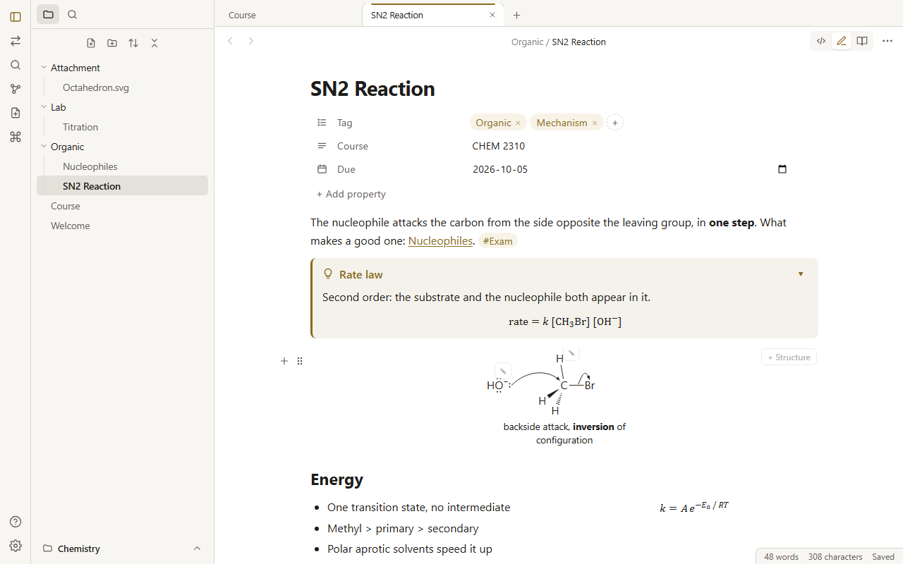
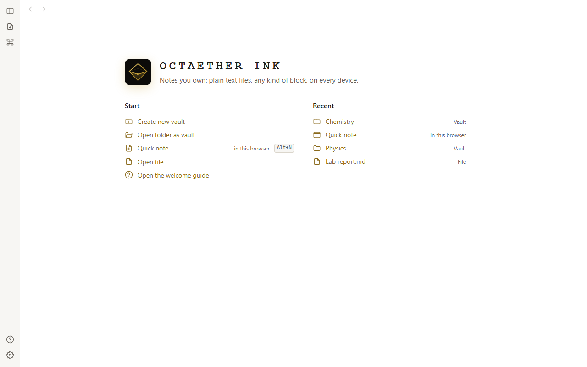
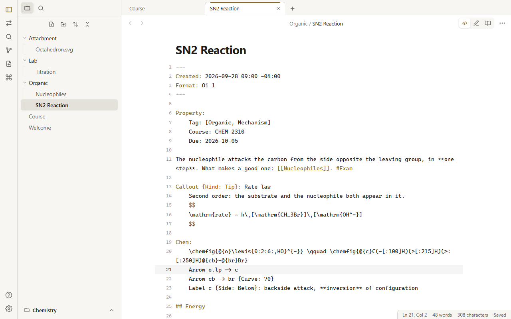
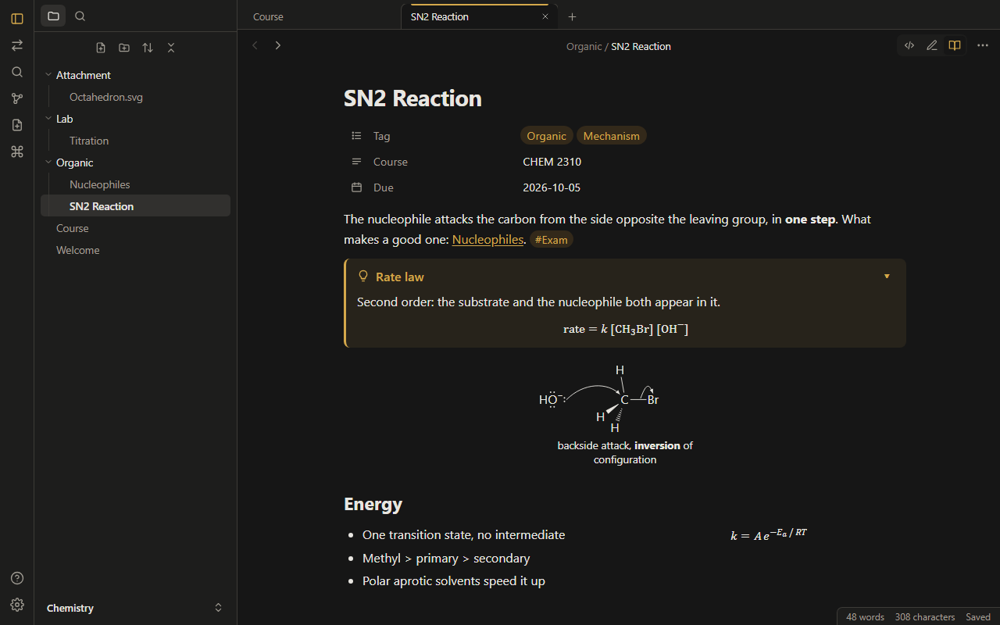
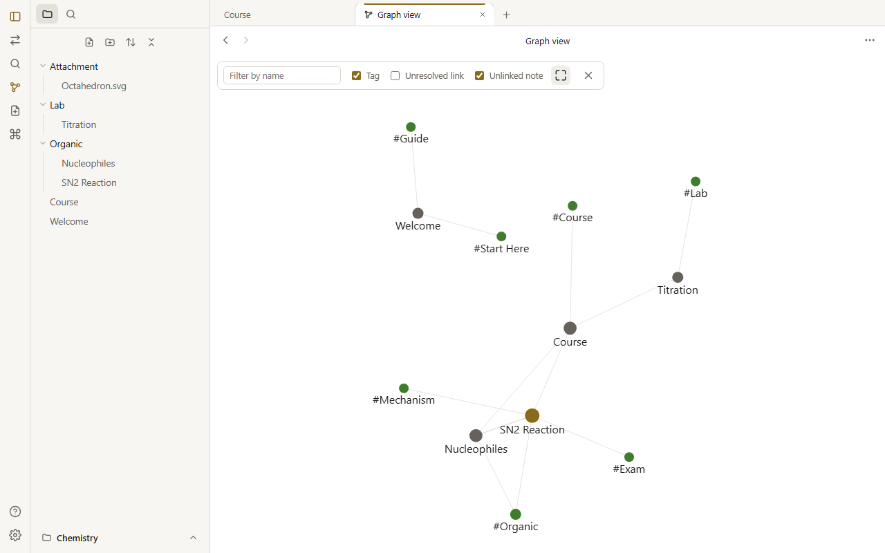
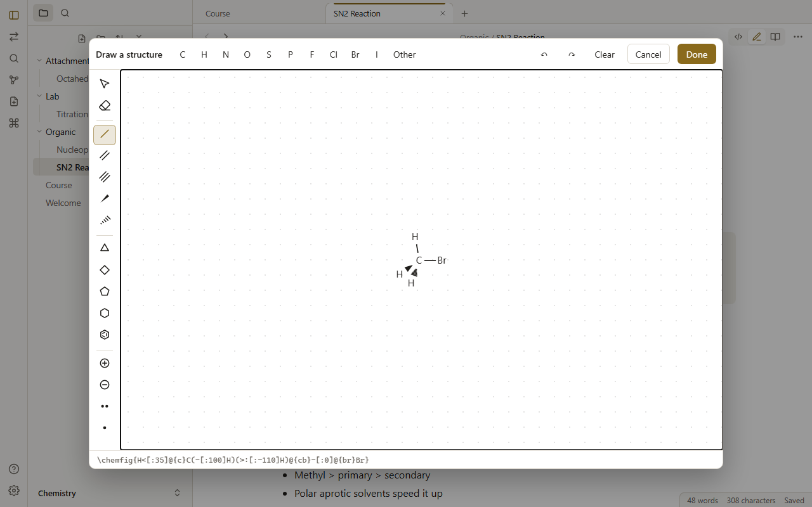
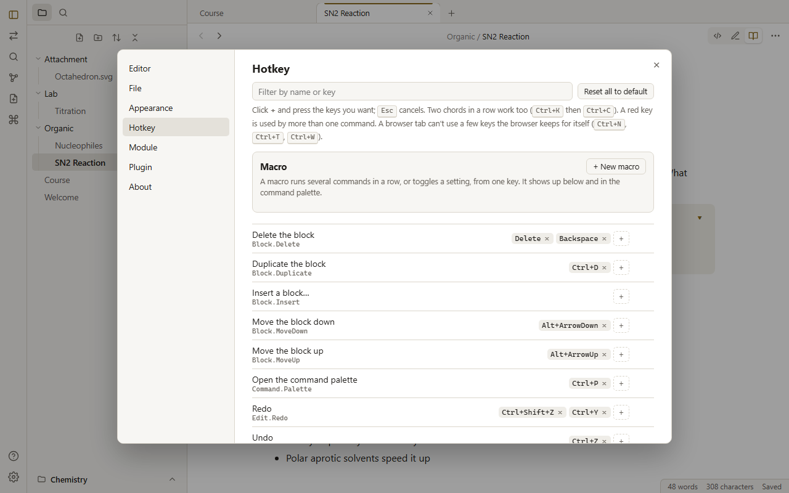
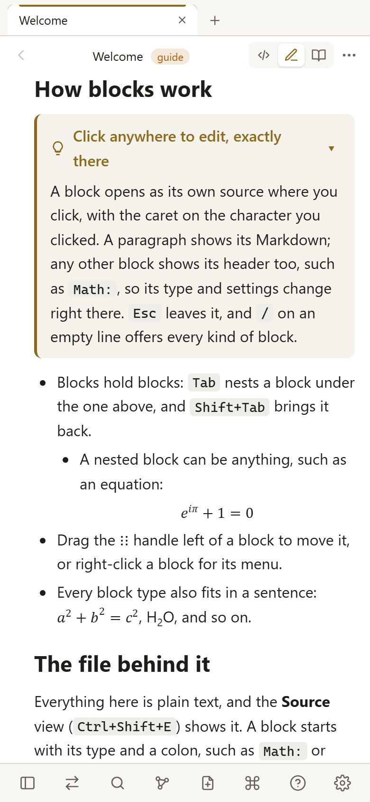

<p align="center">
  
</p>

<h1 align="center">Octaether Ink (OI)</h1>

<p align="center">
  <b>Local‑first, block‑based notes.</b> Plain‑text <code>.oi</code> files you own, with text, math, chemistry, code, diagrams, pictures, videos, and callouts in one note.<br>
  Works in the browser today; desktop, iPad, and phone apps come next.
</p>

<p align="center">
  <a href="https://ink.octaether.com"><b>Open the web app</b></a> ·
  <a href="#quick-start">Run it locally</a> ·
  <a href="#using-octaether-ink">User guide</a> ·
  <a href="#deploy">Deploy</a> ·
  <a href="#roadmap--todo">Roadmap &amp; TODO</a> ·
  <a href="#specification">Specification</a>
</p>



> **Status: version 1**, file format `Format: Oi 1`. Everything in the [user guide](#using-octaether-ink) works now. The [specification](#specification) is the full design the build follows, and the [roadmap](#roadmap--todo) tracks what is done and what is next.
> Website: [octaether.com](https://octaether.com) · Licence: [MIT](LICENSE)

## Contents

- [Highlights](#highlights)
- [Quick start](#quick-start)
- [Using Octaether Ink](#using-octaether-ink)
  - [First launch: a vault, a quick note, or a file](#first-launch-a-vault-a-quick-note-or-a-file)
  - [Files: new, save, rename, delete](#files-new-save-rename-delete)
  - [Tabs](#tabs)
  - [Three views: Source, Edit, Read](#three-views-source-edit-read)
  - [Writing with blocks](#writing-with-blocks)
  - [Pictures, videos, Markdown, and HTML](#pictures-videos-markdown-and-html)
  - [The top of a note: name and properties](#the-top-of-a-note-name-and-properties)
  - [Find, search, links, and the graph](#find-search-links-and-the-graph)
  - [Chemistry: mechanisms and the drawing tool](#chemistry-mechanisms-and-the-drawing-tool)
  - [Hotkeys and macros](#hotkeys-and-macros)
  - [Setting](#setting)
  - [Status bar](#status-bar)
  - [When a block can't render](#when-a-block-cant-render)
  - [Offline, install, and phones](#offline-install-and-phones)
- [Syntax at a glance](#syntax-at-a-glance)
- [Deploy](#deploy)
- [Roadmap & TODO](#roadmap--todo)
- [Specification](#specification) (sections 1–16)

## Highlights

- **Your notes are plain text.** A note is a `.oi` file you can read in any editor, diff in git, and sync with anything. Markdown lines are blocks by themselves; any other block starts with its type and a colon, `Math: x^2` or `Code: Python`, as in Python, and its settings go in braces before the colon, `Math {Numbered: True}:`, the same for every block.
- **Markdown's symbols still work.** Three backticks around code and `$$` around math are *aliases* of `Code:` and `Math:`, so notes from Obsidian open as they are. Every module can have aliases, and each can be switched off or changed.
- **Everything is a block.** Paragraphs, list items, math, code, chemical mechanisms, diagrams, pictures, videos, callouts, columns, and properties are blocks, and blocks hold blocks. Any block type also works inline in a sentence: `{Chem: 2H_2 + O_2 -> 2H_2O}`.
- **Obsidian‑style app, VS Code‑style start.** A vault is a folder on your disk: create one or open one, and switch between them from the bottom of the sidebar. Tabs, a file sidebar (pictures, videos, and sounds open in a tab of their own), search, graph view, backlinks through `[[links]]`, and, when a note wants fields of its own, an optional Property block. No folder at hand? A **quick note** is kept in the browser until you move it into a vault.
- **Three views.** *Source* shows the whole note as text, with line numbers and colors, like a code editor. *Edit* lets you click anywhere in a rendered block and type exactly there, in the block's own source, header included. *Read* never changes anything by accident.
- **Own renderers.** Our own TeX → MathML engine, chemfig parser (with electron‑pushing arrows and lone pairs), TikZ subset, Markdown, HTML cleaner, and code highlighter. Themes, fonts, and "click this part to edit it" work the same in all of them.
- **A drawing tool for structures,** like the ALEKS or ChemDraw editor. Draw a molecule and it becomes chemfig text in your note.
- **Every key is yours.** Rebind any command, like a game's controls screen, with chords and conflict warnings. Macros chain commands and toggle settings. `Ctrl+Z` works everywhere, renames included.
- **Modules and plugins.** Every block type comes from a module, every system function from a plugin. Each can be switched off and has its own settings.

## Quick start

**Use it:** open **[ink.octaether.com](https://ink.octaether.com)**. In Chrome or Edge a vault is a folder on your disk; every browser, Safari and Firefox too, keeps quick notes. It installs as an app, opens at once, and works offline.

**Develop:**

```bash
npm install
npm run dev       # web app at http://localhost:5173
npm test          # 229 tests: format round trip and aliases, model, vault, edit actions, every module, render host, app
npm run check     # TypeScript type-check of every package
npm run build     # production build of the web app → app/web/dist
npm run preview   # serve the production build locally
```

Requires Node 22+. No global installs. The repository is an npm workspace (see [§3](#3-architecture) for the layout). While the dev server runs, the app may save notes into `sample/`; the dev server doesn't reload the page for that (a small plugin in `app/web/vite.config.ts`), so the open editor and its undo history stay.

---

## Using Octaether Ink

### First launch: a vault, a quick note, or a file

The first screen works like Obsidian's vault manager and VS Code's start page. **A vault is a folder of notes on your disk**:

| Choice | What it does | Where it works |
|---|---|---|
| **Create new vault** | Give it a name and choose where it goes: the app makes the folder there and opens it, ready for a first note. The place is remembered for the next vault | Chrome, Edge (File System Access), and the desktop app later |
| **Open folder as vault** | A folder of notes you already have becomes a vault, with a sidebar, search, and graph. The app writes only inside one hidden `.oi/` folder there | Chrome, Edge, and the desktop app later |
| **Quick note** | A note kept in this browser, with no folder needed: for something to jot down now and file later (see below) | Everywhere: Safari, Firefox, iPad, and phones too |
| **Open file** | Edits one `.oi`, `.md`, or `.txt` file. Chrome and Edge save it in place; other browsers download it on `Ctrl+S` and keep a draft meanwhile | Everywhere |
| **Open the welcome guide** | A small vault in memory: an overview and one note per module, linked to each other so the graph view draws them as a map. Changes stay until it is closed | Everywhere |

- **Recent** lists the vaults, quick notes, and files you opened, so you can reopen them with one click. **×** takes one off the list; nothing is deleted.
- **Switch vaults** from the vault's name at the bottom of the sidebar, as in Obsidian: it lists the vaults you use (the open one ticked), then *Create new vault*, *Open folder as vault*, and *Close vault*. *Switch vault* in the command palette does the same from the keyboard. The vault on screen stays until the next one is ready, which then shows with its tabs, with no flash of the start screen in between.
- **The last vault reopens by itself** next time, with its tabs (setting *File → Reopen what was open*). A folder may need one click to allow access again, because browsers ask once per session. If the folder is gone, the start screen says so and removes it from the list.

**Quick notes** are one place per browser for notes that don't need a vault (yet):
- *Quick note* on the start screen, or `Alt+N` with no vault open, starts one. They are a flat list of notes: links, search, pictures, and the graph work, but there are no folders to make.
- A warning on top of the sidebar says they are **kept only in this browser**: clearing the site's data deletes them, and there is no trash: a quick note you delete comes back only with the **Undo** button shown for a few seconds right after. The vault name at the bottom reads *Quick note · in this browser*.
- **Move to a folder** moves them all into a folder (an existing vault, or a new folder) and opens it as the vault; the browser's copies are removed only after every file is written. **Download .zip** saves a copy of them all (it works in every browser).
- Later, a quick note (or a whole vault) is also what you send to another device in one go ([Transfer](#9-transfer-sync-collaboration-history)).



### Files: new, save, rename, delete

- **New note** (`Alt+N` in a browser tab, `Ctrl+N` in the desktop app, or the ribbon button) makes "Untitled", then "Untitled 1", and so on, each in a tab of its own. The name is selected so you can type the real one, as in Obsidian, and `Enter` goes on to the first line.
- **A blank note is never kept.** An Untitled note stays unwritten until it has content. If you leave it blank, or type and then undo back to nothing, it is **deleted for good**: not left behind as another Untitled file and not moved to the trash. A note you *named* is kept even while empty.
- **Saving is automatic** in a vault and for files opened with write access, 0.6 s after you stop typing, when you switch notes, and when the page is hidden. The status bar shows *Saved*, *Saving…*, *Unsaved*, or *Not saved!*; click it (or press `Ctrl+S`) to save now. A single file without write access keeps a draft in the browser. If you close it (or open something else) with unsaved changes, the app asks first.
- **Rename** by editing the name at the top of the note, pressing `F2`, or from the file menu. Links to it in other notes (`[[Old name]]`) are rewritten (setting *Update links when renaming*). `Ctrl+Z` renames it back, in order with your edits.
- **Delete** (the file menu, the right‑click menu, or `Delete` in the sidebar) asks first, then moves the note or folder to the **vault's trash**: the `.oi/Trash/` folder inside the vault, which your file manager shows too. (A web page can't reach the computer's recycle bin, so the trash travels with the vault, as Obsidian's *.trash* option does.) The message after a delete has **Undo**, which puts it back and opens it again. To restore something later, *Open the trash* in the command palette lists what is there. Settings can switch the question off or make deletes permanent; Undo works either way, right after.
- **Quick notes have no trash.** Deleting one always asks first. After it, the **Undo** button in the message (shown for a few seconds; it stays while the pointer is on it) is the only way to get the note back; once it is gone, so is the note.
- **Move** notes and folders by dragging them in the sidebar; links follow.

### Tabs

- **Every note opens in a tab**, as in Obsidian and VS Code, and so does a picture, a video, or a sound of the vault: click it in the sidebar (or a `[[Cell.png]]` link) and it shows on its own; a click on a picture shows its real size. `Ctrl`+click a link, a file in the sidebar, or a search result to open it in a new tab. A note that is already open is shown in its tab rather than opened twice.
- A **middle‑click** or **×** closes a tab (`Alt+W` in a browser tab, `Ctrl+W` in the desktop app), dragging reorders tabs, **+** makes a new note, and a right‑click offers *Close every other tab*, *Close every tab to the right*, *Copy link*, and *Show in the sidebar*. `Alt+PageDown` and `Alt+PageUp` step through them.
- **Each tab has its own Back and Forward.** The graph view and files open in the tab too, so Back (or `Esc`, for the graph) returns to the note. Each tab keeps where it was scrolled to.
- An unsaved note shows a dot on its tab. The tabs of a vault (notes and files) come back when you open it again.

### Three views: Source, Edit, Read

The three buttons at the top right switch views (`Ctrl+E` toggles Edit and Read, `Ctrl+Shift+E` opens Source). The view for newly opened notes is a setting.

| View | What you see | Use it for |
|---|---|---|
| **Source** | The whole `.oi` file as text, like VS Code: line numbers, the current line, colors for properties, block headers, aliases, and Markdown marks. `Tab`/`Shift+Tab` indent selected lines, `Enter` keeps the indentation. The status bar shows `Ln, Col` | Big edits, repairs, pasting from elsewhere |
| **Edit** (default) | Rendered blocks. Click anywhere to edit **at exactly that spot**: the block turns into its own source in place. A paragraph shows its Markdown; any other block shows its header too (`Math: x^2`, ```` ```Python ````), so its type and settings change right there. The block is outlined, and the block around it gets a dashed outline | Writing |
| **Read** | Rendered blocks that never turn into text. Links, tags, and to‑do boxes still work | Reading and presenting |





### Writing with blocks

- `Enter` at the end of a line makes a new block. `Backspace` at the start joins it with the block above. `Tab` nests a block under the one above, and `Shift+Tab` brings it back.
- **A block starts with its type and a colon:** `Math: x^2`, or `Code: Python` with the code on the indented lines below. Settings for one block go in braces before the colon, the same for every block: `Math {Numbered: True}:`, `Code {LineNumber: True}: Python`, `Callout {Kind: Tip}: Title`. Type a header alone in an empty paragraph and press `Enter` to turn the paragraph into that block: `Math:`, `Code: Python`, `Image: Cell.png`, or an alias (three backticks, `$$`).
- **`/` on an empty line** opens the block menu: Math, Code, Chemistry (write or draw), Diagram, Image, Video, Markdown, HTML, Callout, Columns, Property, headings, lists, to‑dos, quotes, and tables. Each entry says what it makes.
- **Hover a block** for `+` (add below) and `⋮⋮` in the left margin. Drag `⋮⋮` to move the block: every block shows its outline, a line shows exactly where it will land (right away, as you move up or down), and moving right over a block drops it inside. The page scrolls near the edges. The handle stays put while you reach for it, so blocks in a right‑hand column can be dragged too.
- **Right‑click** (long‑press on touch) for the block menu: *Turn into*, *Add block below*, *Add column left/right*, *Duplicate*, *Move up/down*, *Nest*, *Move out*, *Copy as OI text*, *Delete*.
- **Select text** for the format bar: bold, italic, strikethrough, highlight, code, inline math, link, and color (a theme color, or any hex code). The same actions have hotkeys. With text selected on the page, `Delete` or `Backspace` removes it and typing replaces it; the block that was selected is left alone.
- **Undo and redo work everywhere** (`Ctrl+Z`, `Ctrl+Shift+Z` or `Ctrl+Y`): while typing in a block, on the page, and in the note's name. They step through the whole note's history, including splits, merges, moves, type changes, and renames.
- **Code** is `Code: Python` with the code indented below it (`Code {Wrap: True}: Python` for one block's settings). **Display math** is a `Math:` block. **Aliases:** a Markdown fence (```` ```Python ```` … ```` ``` ````) is a Code block and `$$ … $$` a Math block, as in Obsidian; *Setting → Module → Code* (or *Math*) switches them off or changes the symbols. **Callouts** are `Callout {Kind: Tip}: Title`, and Obsidian's `> [!tip] Title` works too.
- **The pointer shows where a click lands:** in the Edit view, the character (or the piece of an equation or drawing) under the pointer is highlighted (*Setting → Appearance*: on or off, and its color).

### Pictures, videos, Markdown, and HTML

- **Paste** (`Ctrl+V`) or **drop** a picture or a video on a note: it is saved in the vault's `Attachment` folder, named after the note, and an Image or Video block shows it (setting *File → Folder for pasted pictures*).
- **Image:** `Image {Width: 320}: Cell.png` with the caption on the lines below. A name alone finds the file anywhere in the vault, as in Obsidian; a path starts at the vault's top or at the note's folder; a web address loads from the web. `{Align: Left}` (or `Center`, `Right`) places it, and in the Read view a click shows it full size.
- **Video:** `Video {Start: 90}: https://youtu.be/…` plays YouTube (in its privacy‑enhanced player, which sets no cookies until you press play), Vimeo, or a video file. `{Loop: True}` and `{Muted: True}` do what they say. A player takes clicks for itself, so click the caption (or the address under the video) to edit the block.
- **Pictures in text:** `` as in Markdown, or `![[Cell.png|300]]` as in Obsidian (the number is a width).
- **Drag a file from the sidebar onto a note** to use it there: a picture or a video gets its block, any other file a link.
- **Markdown:** a `Markdown:` block keeps a whole Markdown document in one block (a README, a page from elsewhere), drawn like the rest of the note, with nested lists, to‑dos you can tick, tables, and code.
- **HTML:** an `HTML:` block (or `{HTML: <kbd>Ctrl</kbd>}` in a sentence) shows HTML for what Markdown can't say. It is cleaned first: scripts, forms, frames, and event handlers are removed, `class` and `id` are dropped, and `style` keeps only colors, sizes, and spacing.

### The top of a note: name and properties

- **The name at the top is the file's name.** Edit it to rename the file, and press `Enter` to go on writing. `Ctrl+Z` renames it back.
- **Properties are an optional block.** A note needs none. When you want fields of your own (tags, a due date, a rating), *+ Add property* under the name (or `/property` where you are writing, or `Ctrl+;`) adds a **Property** block, where each field is a row, as in Obsidian. It is a block like any other: it can sit anywhere in the note and be dragged, and tags and search find it wherever it is.
  - tags are pills: click one to edit it in place, drag it to move it, **+** adds one (`Enter` or `,` starts the next), and `×` removes one;
  - each field has a type from YAML's basic ones: Text, List, Number, Checkbox, Date, or Date & time, with a matching control. Click the type icon to change it, and drag the icon to move the field;
  - in the file it is plain `Key: value` lines, so other tools can read them.
- **The note's own header** (`Created`, `Id`, `Format`, between `---` lines) belongs to the app and shows only in the Source view. A note that keeps fields of its own there (from Obsidian, say) gets an offer to show them as properties.

### Find, search, links, and the graph

- **`Ctrl+F`** finds in the note, and **`Ctrl+H`** (`⌘⌥F` on a Mac) replaces. Matches are highlighted in the rendered note itself, even inside bold text or table cells, with match case and regular‑expression toggles. `Enter`/`Shift+Enter` step through them. In the Source view it searches the text.
- **`Ctrl+Shift+F`** searches every note in the vault. `tag:Exam` finds tags, and tags in Property blocks count. Clicking a result opens the note with the match highlighted (`Ctrl`+click: in a new tab).
- **`Ctrl+O`** is the quick switcher: type part of a name (of a note, or of a picture, video, or sound), or a new name to create a note.
- **`[[Note]]`** links to a note, and clicking it opens it (`Ctrl`+click: in a new tab; a missing note is offered for creation). `[[Cell.png]]` opens the picture on its own. `#Tag` and `#[Tag With Space]` are tags.
- **`Ctrl+G`** opens the graph view in the tab: every note as a dot and every link as a line. Tags, unresolved links, and unlinked notes can be shown or hidden. Drag dots, pan, zoom, filter by name, and click a note to open it. Back (or `Esc`) returns to the note.



### Chemistry: mechanisms and the drawing tool

Chemistry blocks use chemfig, with what organic mechanisms need on top:

````text
Chem:
	\chemfig{@{o}\lewis{0:2:6:,HO}^{-}} \qquad \chemfig{@{c}C(-[:100]H)(>[:215]H)(>:[:250]H)@{cb}-@{br}Br}
	Arrow o.lp -> c
	Arrow cb -> br {Curve: 70}
	Label c {Side: Below}: backside attack, **inversion** of configuration
````

- **Lone pairs and radicals:** `\lewis{0:2:6:,HO}` puts electron pairs at 0°, 90°, and 270° (the number × 45°; `:` a pair, `.` one electron, `|` a bar).
- **Electron‑pushing arrows** start from a lone pair (`o.lp`, or `o.lp2` for the second pair), an atom, a bond's middle (a named bond such as `cb`), a point between two atoms (`a!0.5!b`), or coordinates. `Kind: Pair` (full arrowhead) or `Fishhook` (one electron). Without `Curve`, the arrow bows away from the molecule by itself. chemfig's `\chemmove{\draw[->](a) .. controls … .. (b);}`, `to[out=…,in=…]`, and `bend left` work too.
- **Labels** are Text blocks placed in the drawing (Markdown and `{Math: …}` inside), and they step away from atoms, bonds, and arrows so they never overlap.
- **Drawing tool:** hover a molecule and click ✎ to edit it, or *+ Structure* / *Draw a structure* for a new one. Pick a tool (select, erase, single/double/triple bond, wedge, hash, rings, charges, lone pair, radical, elements) and click or drag on the canvas: bonds snap to 30°, and rings fuse onto bonds. Keys work on what the pointer is over: `C` `H` `N` `O` `S` `P` `F` `I` `L` (Cl) `B` (Br) set the element, `1`–`3` the bond order, `+`/`-` the charge, and `Delete` removes. The wheel zooms, `Ctrl+Z` undoes, and `Enter` places the result into the note as chemfig text.



### Hotkeys and macros

Default keys (on a Mac, `Ctrl` is `⌘` and `Alt` is `⌥`):

| Action | Keys | | Action | Keys |
|---|---|---|---|---|
| New note | `Alt+N` (tab) · `Ctrl+N` (app) | | Bold · italic | `Ctrl+B` · `Ctrl+I` |
| Close tab · next · previous | `Alt+W` (tab) · `Ctrl+W` (app) · `Alt+PageDown` · `Alt+PageUp` | | Strikethrough · highlight | `Ctrl+Shift+X` · `Ctrl+Shift+H` |
| Quick switcher (open a file outside a vault) | `Ctrl+O` | | Inline code · inline math | `Ctrl+Shift+C` · `Ctrl+Shift+M` |
| Save now | `Ctrl+S` | | Link | `Ctrl+K` |
| Command palette | `Ctrl+P` | | Duplicate block | `Ctrl+D` |
| Setting | `Ctrl+,` | | Move block up · down | `Alt+↑` · `Alt+↓` |
| Edit ⇄ Read · Source | `Ctrl+E` · `Ctrl+Shift+E` | | Delete the selected block (or the highlighted text) | `Delete` / `Backspace` |
| Find · replace | `Ctrl+F` · `Ctrl+H` (`⌘⌥F`) | | Undo · redo (anywhere, renames too) | `Ctrl+Z` · `Ctrl+Shift+Z` / `Ctrl+Y` |
| Search every note | `Ctrl+Shift+F` | | Add a property | `Ctrl+;` |
| Graph view | `Ctrl+G` | | Next theme | `Ctrl+Shift+L` |
| Back · forward | `Ctrl+Alt+←` · `Ctrl+Alt+→` | | Rename note | `F2` |

- **Rebind anything** in *Setting → Hotkey*, like the controls screen of a game: click **+** and press the keys. Two chords in a row work (`Ctrl+K` then `Ctrl+C`). A key used by two commands turns red, **×** removes a key, **↺** restores the default, and the list filters by name or key. (A browser tab can't use a few keys the browser keeps, such as `Ctrl+N`, `Ctrl+T`, and `Ctrl+W`.)
- **Macros** are your own commands: a name and a list of steps. A step is any command, such as *Toggle a setting* (`Setting.Toggle`), *Switch theme*, or *Set the view*, with a value picked from a list. Macros show up in the command palette and take hotkeys like any command.
- Keys and macros are saved in the browser and in the vault's `.oi/Hotkey.oi`, so they travel with the vault:

```text
Kind: Hotkey
Format: Oi 1
Binding:
	- {Command: Graph.Open, Key: Mod+G}
	- {Command: Graph.Open, Key: Alt+Shift+1 Alt+Shift+2}
Macro:
	- {Id: Macro.LectureMode, Title: Lecture mode, Step: [{Command: Setting.Toggle, Argument: Code.LineNumber}, {Command: View.Set, Argument: Read}]}
```



### Setting

`Ctrl+,` opens Setting: **Editor, File, Appearance, Hotkey, Module, Plugin, About**. Every setting explains itself. Values are saved in the browser and, in a vault, in `.oi/Setting.oi` (only values that differ from the default).

| Setting | Choices (default first) | What it does |
|---|---|---|
| `Editor.ClickToEdit` | SingleClick, DoubleClick, HotkeyOnly | How a block turns into its source |
| `Editor.DefaultView` | Edit, Read, Source | The view notes open in |
| `Editor.ReadableWidth` | On, Off | Keeps lines about 750 px wide |
| `Editor.BlockOutline` | On, Off | Outlines the block being edited (with its type) and, dashed, the block around it |
| `Appearance.FontSize` | 16px, 14–20px | Text size of the note |
| `Appearance.AccentColor` | Octaether gold, or any color | The color of links, buttons, outlines, and tags: pick it or type a hex code; ↺ goes back to the theme's own |
| `Appearance.HoverHighlight` | On, Off | Lights up the character (or equation piece) under the pointer in the Edit view |
| `Appearance.HoverColor` | The accent, or any color | The color of that highlight |
| `Theme.Active` | System, then every theme there is (Light, Dark, and those plugins and modules add, such as Paper and HighContrast) | The theme of the whole app, shown as *Theme* at the top of *Appearance*. System follows the device's light or dark mode. Whatever sets it (this list, *Switch theme*, a macro, a vault's `Setting.oi`) shows at once |
| `File.OpenLast` | On, Off | Reopens the last vault (with its tabs) or file |
| `File.NewNoteLocation` | VaultRoot, CurrentFolder | Where new notes go |
| `File.DeleteTo` | Trash, Permanent | Deleted files go to the vault's `.oi/Trash`, or are deleted with no trash to restore from (either way, Undo works for a few seconds right after; quick notes have no trash) |
| `File.ConfirmDelete` | On, Off | Asks before deleting |
| `File.UpdateLink` | On, Off | Renaming rewrites `[[links]]` |
| `File.AttachmentFolder` | `Attachment` | Where pasted or dropped pictures and videos go (empty: next to the note) |

**Each module and plugin has its own page** (*Setting → Module → Chemistry*…) with its on/off switch and its own settings. A block type with aliases also gets **Alias** (on or off) and **Alias symbols** (the symbols, separated by spaces); symbols two modules want are kept by the module listed first, and the page of the other one says so.

| Module | Settings |
|---|---|
| Text | `Text.TaskToggle` (tick to‑dos by clicking), `Text.TagPill` (tags as pills), `Text.SpellCheck` |
| Property | `Property.ShowType` (type icons), `Property.TagHash` (a `#` before tags) |
| Math | `Math.Font` (Default, STIX Two Math, Latin Modern Math, Cambria Math, Noto Sans Math), `Math.Numbering` (Numbered, All, None), `Math.ShowError`, `Math.Alias`, `Math.AliasMarker` (`$$`) |
| Code | `Code.LanguageLabel`, `Code.CopyButton`, `Code.LineNumber`, `Code.Wrap`, `Code.Highlight`, `Code.TabSize` (2, 4, 8), `Code.Alias`, `Code.AliasMarker` (```` ``` ~~~ ````) |
| Chemistry | `Chem.BondLength` (Short, Normal, Long), `Chem.LabelAvoid`, `Chem.ShowProblem` |
| Diagram | `Diagram.Scale` (75–150%), `Diagram.ShowProblem` |
| Image | `Image.Align` (Center, Left, Right), `Image.Zoom` (a click in the Read view shows it full size) |
| Video | `Video.Width` (100%, 75%, 50%) |
| HTML | `HTML.Style` (keep colors and spacing written in `style`) |
| Layout | `Layout.StackWidth` (columns stack below 480px, 640px, 800px, or Never) |
| Theme (plugin) | None: it adds the Paper and HighContrast themes, which you pick in *Appearance* like any other |

A changed module setting re‑renders every block of that type (inline ones too) at once, and a changed alias reads open notes again. `.oi/Setting.oi` may be written flat or nested:

```text
Kind: Setting
Format: Oi 1

# how blocks open
Editor:
	ClickToEdit: DoubleClick
Code.LineNumber: True
```

### Status bar

The bar at the bottom right shows, from left to right:

- the cursor position in the Source view (`Ln 8, Col 1`);
- the word count (`4 of 155 words` while text is selected);
- the character count;
- the save state (click it to save now).

Modules and plugins add their own items through `statusItemList` in their definition (the Text module adds the word and character counts). Each item can be switched off in *Setting → Appearance*.

### When a block can't render

Nothing is ever lost. A block that can't render as intended keeps its text on screen and gets a **dashed outline**:

| Outline | Why | What you see |
|---|---|---|
| Amber, dashed | Its module is off | "`Math`: the Math module is off (Setting → Module). Its text is kept as it is." and the source |
| Amber, dashed | No module for its type (`Sheet:` without a Sheet module) | "no module is installed for this block type" and the source |
| Red, dashed | The renderer failed, or the content has mistakes (an unknown TeX command, a chemfig typo) | The error, the source, or the drawing with the mistake explained below it (each module's *Show mistakes* setting) |

### Offline, install, and phones

- The web app is a **PWA**: after the first visit it opens offline, and it installs as an app. In Chrome or Edge, use the install icon in the address bar; on iPad and iPhone, use Safari → Share → *Add to Home Screen*. The installed app on a computer can open `.oi` files from the file manager.
- **It opens at once.** After the first visit the app starts from the copy the browser keeps, never waiting on the network, so a slow or stalled connection can't hold it up. A new version downloads in the background, and a message offers **Reload** when it is ready.
- **On phones** the ribbon becomes a bottom bar, the sidebar a drawer, and columns stack. Long‑press opens the block menu.

  
- **Where notes live:** in your vault's folder, or, for quick notes, in the browser's own storage (IndexedDB, not cookies). Browsers can clear site storage, so quick notes are for jotting down: move them into a vault, or download them as a `.zip`, from the warning on top of their sidebar.

---

## Syntax at a glance

A note is a `.oi` file. The full grammar is in [§5.3](#53-syntax-rules-normative).

````text
---
Created: 2026-09-29 10:02 -04:00
Id: 01j9zq3k7x4m2v8r6t0b5n1c9d
Format: Oi 1
---

A paragraph is a Text block. **Bold**, *italic*, ==highlight==, `code`, [[Another Note]], #Tag,
inline math {Math: e^{i\pi} + 1 = 0}, any block inline {Chem: 2H_2 + O_2 -> 2H_2O}, [colored]{Color: Accent}.

- A list item is a block.
	- A deeper line is a child of the block above:
		Math: a^2 + b^2 = c^2

Math {Numbered: True}: E = mc^2

Code {LineNumber: True}: Python
	def rate(k, a, b):
	    return k * a * b

$$
\int_0^\infty e^{-x^2}\,dx = \frac{\sqrt{\pi}}{2}
$$

```JavaScript
console.log('an alias: a Markdown fence is a Code block');
```

Image {Width: 240}: Attachment/Benzene.png
	The caption, in *Markdown*.

Property:
	Tag: [Organic, Lecture 05]
	Course: CHEM 2310

Callout {Kind: Warning}: Callouts hold blocks
	Any block, including this text and a table.

> [!tip] Obsidian's callouts work too

Grid {Gap: 16px}:
	Column {Width: 60%}:
		Chem:
			\chemfig{*6(=-=-=-)}
	Column {Width: 40%}:
		Diagram:
			\draw[->] (0,0) -- (2,1) node[right] {$v$};
````

| Write | Get |
|---|---|
| A Markdown line | A Text block: heading, list item, to‑do, quote, table, or paragraph |
| `Type {Props}:` + indented lines | A typed block, its settings in braces (the same for every type); its body is raw text (`Math`, `Chem`, `Diagram`) or child blocks (`Callout`, `Grid`, `Column`, Text) |
| `Code {Wrap: True}: Python` + indented lines | A block whose type takes a **header argument** (`Code` → `Language`, `Image` and `Video` → `Source`): its main setting after the colon, the body on the lines below |
| `Property:` + `Key: value` lines | An optional block of your own fields (tags, dates, …), anywhere in the note |
| ```` ```Python ```` … ```` ``` ```` · `$$ … $$` | **Aliases:** a `Code` block, a display `Math` block (as in Markdown and Obsidian; each can be switched off or changed) |
| `{Type: …}` · `[text]{Props}` | Any block type inline (`{Math: x^2}`) · a styled span |
| `` · `![[Cell.png\|300]]` | A picture inside text |
| `[[Note]]` · `[[Note#^id]]` · `#Tag` | A link · a link to a block · a tag |
| `^id` at the end of a header or text | A block ID, written only when something links to the block |

---

## Deploy

The web app is a static site. It deploys to **[ink.octaether.com](https://ink.octaether.com)** with Vercel, and everything it needs is in this repository:

| File | Purpose |
|---|---|
| [`vercel.json`](vercel.json) | Install `npm ci`, build `npm run build`, serve `app/web/dist`. Security headers (a strict Content‑Security‑Policy: scripts only from the site itself, no eval, pictures and videos from the web and from the vault (`blob:`), and frames only for the YouTube and Vimeo players), long caching for hashed `/assets/*`, no caching for `sw.js`, and every path served by `index.html` |
| [`app/web/public/manifest.webmanifest`](app/web/public/manifest.webmanifest) | Makes the app installable, with a file handler for `.oi` |
| [`app/web/public/sw.js`](app/web/public/sw.js) | Offline support and an instant start: the page comes from the cache at once and is refreshed in the background with every file it needs (open pages then offer Reload); built files are cache‑first |
| `app/web/public/icon*.svg/png` | App icons (the Octaether octahedron in gold on black, its lower half a pen nib), including a maskable one and the Apple touch icon |

**First deployment (about 10 minutes):**

1. **Put the repository on GitHub** (for example `github.com/Feltlin/OctaetherInk`), with `package-lock.json` committed.
2. **Import it into Vercel:** [vercel.com/new](https://vercel.com/new) → *Import Git Repository* → pick the repository.
   - *Framework Preset*: **Other**. *Root Directory*: the repository root, left as it is. Build, output, and install settings come from `vercel.json`, so leave them empty.
   - Under *Settings → Build and Deployment*, set the *Node.js Version* to **22.x** or newer.
3. **Deploy.** Vercel builds and gives the project a `*.vercel.app` address. Open it and check that the start screen appears.
4. **Add the domain:** *Project → Settings → Domains → Add* → `ink.octaether.com`.
5. **Point DNS at Vercel:** where `octaether.com`'s DNS is managed (the registrar or Cloudflare), add the record Vercel shows. For a subdomain that is a CNAME:

   | Type | Name | Value |
   |---|---|---|
   | CNAME | `ink` | `cname.vercel-dns.com` (or the project‑specific value Vercel displays) |

   On Cloudflare, set the record to *DNS only* (grey cloud) so Vercel can issue the certificate. HTTPS is set up automatically once the record resolves, usually within minutes.
6. **Check it:** open `https://ink.octaether.com`. Open the welcome guide, then reload with the network off (DevTools → Network → Offline); it should still open. Chrome should offer to install the app.

**After that:** every push to the production branch (`main`) deploys to ink.octaether.com, and every pull request gets its own preview address. From a terminal instead: `npm i -g vercel`, then `vercel link` once and `vercel --prod` to deploy.

**If something goes wrong:**
- *Build fails:* run `npm ci && npm run build` locally; the build log in Vercel shows the same output.
- *Blank page:* the Content‑Security‑Policy in `vercel.json` blocks scripts from other origins. Anything new must be bundled, not loaded from a CDN.
- *Old version after a deploy:* the app opens from its cached copy at once and fetches the new version meanwhile; it then shows *A new version of Octaether Ink is ready* with **Reload**. Any reload after that runs the new version. `sw.js` itself is never cached, so a change to it arrives on the next visit.
- *Slow first visit:* the first visit downloads the app (about 160 KB compressed); from then on it opens from the browser's copy. A first request that hangs for seconds is the connection or DNS, not the app: compare with `curl -w "%{time_total}\n" -o /dev/null -s https://ink.octaether.com`.

---

## Roadmap & TODO

This checklist is the project's to‑do list. Tick items in the same change that ships them, add new tasks under **Next**, and move bigger ideas into a phase. (GitHub shows progress for each list.)

### Version 1 (done)

**Format and core**
- [x] `.oi` format `Oi 1`: Markdown lines as Text blocks, typed blocks `Type {Props}:`, children by indentation, properties, escapes, IDs only where written, byte‑exact round trip, and canonical writes that touch only changed blocks
- [x] Header arguments: a type can take its main property after the colon (`Code: Python`, `Image: Cell.png`), and every other property goes in the braces every block uses (`Code {Wrap: True}: Python`)
- [x] Aliases: symbols a module lets you open its block with instead of `Type:` (``` and `~~~` for Code, `$$` for Math, as in Obsidian). Every module can declare them; each has a switch and editable symbols in its settings, clashes between modules are found and reported, and a block keeps the form it was written in
- [x] Inline blocks are `{Name: text}` for every type, math included (`$…$` is plain text)
- [x] Model: operations on runtime keys, transactions, undo/redo with typing coalesced, whole‑text replace from the Source view (one undo step, unchanged blocks keep their keys), a block's own source as one operation (`Block.Source.Set`: its type, properties, and body at once), and steps outside the text (a rename) in the same history
- [x] Render host: keyed nested frames, layouts, placeholders, per‑block error boundary, broken‑block outlines, a read‑only mode, and module settings that re‑render their blocks
- [x] Vault (`core/vault`): a file‑system interface (text and bytes), folder, browser (quick notes), and memory vaults, `.oi/Trash` with restore (empty trash folders tidied away), copies in memory so a delete for good can be undone, link rewriting on rename and move, backlinks, tags (Property blocks included), graph, search, and Obsidian‑style file lookup for pictures
- [x] Registry: modules and plugins on and off, per‑module settings (alias settings generated), alias conflicts, and status‑bar items

**App**
- [x] Start screen like Obsidian's vault manager and VS Code: create a vault (a name and a place), open a folder as a vault, a quick note, open a file, the welcome guide, and recent items. The last vault reopens by itself, with its tabs
- [x] Obsidian‑style shell: ribbon, file sidebar (tree, drag to move, rename in place, context menu, resize), the vault switcher at the bottom, view header with back and forward, and a phone layout (bottom bar, drawer)
- [x] Vaults switch in one step: the next one is read while the current one stays on screen, its settings apply before its notes are drawn, and it shows with its tabs (no flash of the start screen)
- [x] Quick notes: notes kept in the browser with no folder, a warning on top of their sidebar that can't be missed, *Move to a folder*, and *Download .zip*
- [x] Tabs: a tab per note (`Ctrl`+click for a new one), middle‑click to close, drag to reorder, a tab menu, per‑tab back and forward (the graph view and files included), and per‑tab scroll
- [x] Files on their own, as in Obsidian: pictures (PNG, JPEG, GIF, WebP, AVIF, SVG, BMP), videos (MP4, WebM, Ogg), and sounds (MP3, M4A, Ogg, WAV) open in a tab from the sidebar, a link, or the quick switcher; dragging one onto a note adds its block or a link
- [x] Welcome guide: a vault in memory with an overview and one note per module, linked for the graph
- [x] File rules: blank Untitled notes are never kept (not even in the trash), autosave, the vault's trash with Undo right after a delete (and the trash dialog in the palette), quick notes deleted for good only after a warning, a question before deleting, links rewritten on rename, and a question before closing unsaved single files
- [x] Three views: Source (a code‑editor view of the whole note), Edit, and Read. The old text box under the note is gone
- [x] Block editor: every block edits as its own source, header included (`Math:`, ```` ```Python ````), so its type and settings change in place; `Math:`, `Code: Python`, or an alias typed alone and `Enter` turns a paragraph into that block
- [x] Text selected on the page: `Delete` removes it and typing replaces it (instead of deleting the selected block)
- [x] Note top: the name (editing it renames the file) and *+ Add property* for an optional Property block; the note's own header shows only in the Source view
- [x] Find and replace in the note (highlights inside the rendered blocks), search across the vault, quick switcher, command palette, and graph view
- [x] Hotkeys: everything rebindable, chords, conflicts, reset, and macros, saved to `.oi/Hotkey.oi`. `Ctrl+Z` works everywhere: while typing, on the page, in the name, and for renames
- [x] Setting: Editor, File, Appearance, Hotkey, Module, Plugin, About, with a page per module (every label singular)
- [x] Appearance: the accent color (any hex code, ↺ for Octaether gold), the hover highlight (on or off, its color), and hex colors for text
- [x] Pictures and videos pasted or dropped on a note go into the vault's `Attachment` folder, in an Image or Video block (quick notes store the bytes so that private windows in Safari and Firefox take them too)
- [x] Status bar: cursor, word and character counts (selection‑aware), and save state; modules add items
- [x] Editing visuals: an outline and type badge on the block being edited, a dashed outline on the block around it, a gutter outline, block outlines while dragging, a drop line that shows at once, and dragging from right‑hand columns
- [x] Look: the Octaether mark (a gold octahedron whose lower half is a pen nib, on black), warm greys, and no blue or purple anywhere, code colors included
- [x] Deployment files for Vercel, a PWA (offline, installable, opens `.oi` files), and app icons
- [x] Live at ink.octaether.com on Vercel; the app opens from its cached copy at once and offers Reload when a new version is ready
- [x] Development: the dev server doesn't reload the page when the app saves notes into `sample/`

**Modules**
- [x] Text: Markdown subset with source maps, Obsidian callouts in quotes, clickable to‑dos, tags, wikilinks, pictures (``, `![[…]]`), and word count
- [x] Property: fields of YAML's basic types (Text, List, Number, Checkbox, Date, Date & time), tags as pills edited in place and dragged to reorder, type icons, and an add form
- [x] Layout: `Flow`, `Grid` + `Column` (stack width is a setting), and `Callout` (kinds and Obsidian aliases, foldable). `Group` was replaced by `Callout`
- [x] Math: own TeX → MathML with macros, numbering, fonts, and the `$$` alias
- [x] Code: `Code: Python`, the fence aliases, highlighting for 11 languages, a language label, a copy button, and line numbers, wrapping, and tab width as settings (and per block)
- [x] Chemistry: chemfig parser and renderer, schemes, `\lewis` lone pairs and radicals, electron‑pushing arrows (from lone pairs, bonds, midpoints; auto‑bowing), `\chemmove`, labels that avoid the drawing, and the structure drawing tool
- [x] Diagram: TikZ subset
- [x] Image and Video: from the vault or the web, captions, width and alignment, a full‑size view, and YouTube (privacy‑enhanced) and Vimeo players
- [x] Markdown: a whole Markdown document in one block (nested lists, to‑dos, tables, code)
- [x] HTML: a block (or inline) of HTML, through an own whitelist cleaner
- [x] Themes: one choice, owned by the app (*Appearance → Theme*, `Theme.Switch` with a list when no name is given, `Theme.Cycle`), System following the device, and every theme from the app, plugins, and modules in the same list. The Theme plugin adds Paper and HighContrast

**Quality**
- [x] 229 unit and app tests. Strict TypeScript 7 (unused code refused). Build: 486 KB JS (158 KB gzipped) + 40 KB CSS
- [x] Checked in Chromium, WebKit (Safari, iPad, iPhone), and Firefox, at desktop and phone sizes, covering every view, find, undo while typing, dragging (including from a right column), settings, the palette, the drawing tool, browser and folder vaults, trash, graph, reopening, the phone layout, and the review‑5 and review‑6 features (the block source editor, aliases and their clashes, selection delete, pictures pasted and in text, the sample video, files opened on their own, the new modules, renames undone, tabs reopened): 66 checks, all passing. For review 7, 70 more: vaults made, opened, and switched with no frame of the start screen between, delete and Undo on a real folder handle, quick notes in all three engines (kept across a reload, deleted with the warning, undone, downloaded as a `.zip`, moved into a folder), and the service worker served with Vercel's headers (offline, instant with an 8‑second page delay, a new version offered with Reload)

### Next (version 1.x)

- [ ] Export any vault as a `.zip` and import one (quick notes download as a `.zip` already)
- [ ] Send a quick note, or a whole vault, to another device (the first use of `Transfer`)
- [ ] Trash: empty what has been there longer than a set number of days
- [ ] Block links: `[[Note#^id]]`, `![[Note#^id]]` embeds, and "Copy link to block"
- [ ] Backlinks and outline panes in the sidebar
- [ ] Split panes (tabs are done)
- [ ] Image: paste into a single file with no vault (as a data URL or next to the file), crop and resize handles
- [ ] Renaming or moving a picture or a video rewrites the `Image:`/`Video:` blocks and `![[…]]` links that name it, as notes' links are; PDF files open on their own
- [ ] Video and audio recorded in the app
- [ ] Theme files from the vault (`.oi/Theme/*.oi`; the parser exists in the Theme plugin) and macro files (`.oi/Macro/*.tex`)
- [ ] Themes for one module, added by plugins and picked on the module's page (§11.3)
- [ ] Layouts as contributions: Obsidian‑style by default, others (OneNote‑style) from plugins, picked in *Appearance* (§11.3)
- [ ] Reload a note when it changes on disk (VS Code, git, sync tools)
- [ ] Cross‑block text selection
- [ ] Inspector panel (every block property, with explanations)
- [ ] Keyboard toolbar on phones
- [ ] Settings search and a "where does this value come from" badge
- [ ] Toolbar editor (`.oi/Toolbar.oi`) and keymap presets (Obsidian, VS Code, Notion)
- [ ] Math: `\eqref` across blocks and `\ce{}`
- [ ] Chemistry: brackets with `‡`, SMILES input
- [ ] Translations (`Locale/<bcp47>.oi`)

### Phase 0: de‑risking spikes

- [ ] S1 Ink latency: web ink in Tauri on iOS vs a native wet‑ink overlay, measured pen‑to‑pixel
- [ ] S2 Transfer: iPad ↔ Windows over QR + LAN on home Wi‑Fi, campus Wi‑Fi, and a hotspot; BLE throughput
- [x] S3 Format: grammar, parser, serializer, lossless round trip
- [x] S4 Math: own macro engine and a MathML backend, incremental re‑render
- [x] S5 Chemistry: chemfig subset → SVG, mechanisms, and drawing
- [ ] S6 Shell: a Tauri skeleton on TestFlight and a Windows installer (needs the Rust toolchain)

### Phase 1: MVP ("one lecture note, iPad → laptop")

- [ ] Content: `Ink` (web), `Table`, `Plot` 2D, `PDF` → `Page` import with ink (and PDF files opened on their own), `Layout.Page` (`Image` is done)
- [ ] System: `Transfer` (QR + LAN, remembered devices), `ExportPDF`, `ExportZip`, `History` (basic), `ImportObsidian`
- [ ] UI: settings with live demos
- [ ] Platforms: Windows, macOS, iPad (Tauri 2), and the web

### Phase 2: study workflow

- [ ] Content: native wet ink, `Audio`, `Event` + `View` (day, week, month, timeline, table), `Diagram` presets, `Layout.Canvas`, `Layout.Deck` (`Video` is done)
- [ ] System: `Sync` with block merge, BLE transfer, `Calendar`, `Reminder`, `ICS`, `Collab` (LAN)
- [ ] Platforms: Android and iPhone

### Phase 3: power features

- [ ] Content: `Code.Run` (JavaScript, then Python via `RuntimePython`), reactive cells, `Plot` 3D (`HTML` is done)
- [ ] System: `Collab` over the internet, `Registry`, export plugins (Markdown, LaTeX, pptx), recognition features, an own PDF writer

### Known limits of version 1

- Safari and Firefox can't open folders on disk (a browser rule), so they can't hold a vault. Use quick notes and single files there, or Chrome/Edge.
- A folder vault asks for access again after the browser restarts (one click on the start screen).
- A web page can't move files to the computer's recycle bin: deleted files go to the vault's own trash, `.oi/Trash`.
- Graph and search are part of the app shell for now; they become switchable plugins with the plugin loader.
- A pasted picture needs a vault to be saved in; a single file opened on its own can't take one yet.
- YouTube and Vimeo videos, and pictures from web addresses, need the network.
- No native apps yet: Tauri needs the Rust toolchain, which isn't set up.

---

## Specification

The rest of this README is the design: the format, the layers, the platform, and the decisions behind them. Section numbers (§) are stable, so code comments and discussions can refer to them.

1. [Goal & principle](#1-goal--principle)
2. [Naming convention](#2-naming-convention)
3. [Architecture](#3-architecture)
4. [Tech stack & dependency policy](#4-tech-stack--dependency-policy)
5. [Data layer](#5-data-layer)
6. [Rendering layer](#6-rendering-layer)
7. [Editing layer](#7-editing-layer)
8. [Module & plugin platform](#8-module--plugin-platform)
9. [Transfer, sync, collaboration, history](#9-transfer-sync-collaboration-history)
10. [Code execution](#10-code-execution)
11. [UI, theme, hotkey, setting](#11-ui-theme-hotkey-setting)
12. [Platform & packaging](#12-platform--packaging)
13. [Performance budget](#13-performance-budget)
14. [Security, privacy, testing](#14-security-privacy-testing)
15. [Risk](#15-risk)
16. [Decision log & open question](#16-decision-log--open-question)

**In short:**

- **One vault = your folder of notes + exactly one hidden `.oi/` folder** for everything the app owns: settings, hotkeys, trash, themes, stored files, handwriting data, history, and cache.
- **One syntax for everything.** Notes and settings use the same format: Python‑style indentation, YAML‑style `Key: value` properties, **PascalCase** names (`Math`, `Tag`), case‑sensitive throughout. Plain Markdown lines are blocks by themselves; any other block starts with `Type:` (`Math: x^2`, `Code: Python`); modules may add Markdown‑style **aliases** (``` for Code, `$$` for Math).
- **Blocks hold blocks, and anything can be inline.** A deeper‑indented line is a child of the block above. Inside text, `{Type: …}` puts any block type inline (`{Math: x^2}`).
- **No IDs in the file unless something links to a block.** The app tracks blocks with in‑memory keys, so the text stays as clean as Markdown (§5.3).
- **Three layers.** Data (text ⇄ block tree) → Render (a render engine per block type, re‑rendering only what changed, with a mandatory Light/Dark theme protocol) → Edit (blocks show their rendered output; click anywhere to edit the block's own source at exactly that spot).
- **Module vs plugin.** A **module** adds a kind of content, i.e. a block type such as `Math`, `Chem`, `Table`, or a third‑party `Sheet`; it implements storage, render, and edit. A **plugin** adds a system function such as `Transfer`, `History`, `Graph`, `Search`, or an exporter; plugins can also extend modules. Almost everything can be switched on and off.
- **We own the renderers where control matters:** our own TeX parser and macro engine (native MathML with source maps), and our own chemistry, plot, diagram, and ink renderers, so fonts, colors, themes, and "edit just this part" work the same everywhere.
- **Transfer needs no server.** A QR code pairs devices, then an encrypted LAN connection carries the data. Bluetooth LE handles discovery and small notes. Bundles are plain `.zip` files.
- **Collaboration and a git‑like version tree are first‑class goals.** Every edit is an operation that can be merged.

---

## 1. Goal & principle

### Requirement

| Id | Requirement |
|---|---|
| R1 | One block‑based note can mix text, handwriting, math, chemistry, plots (2D, 3D, Desmos‑like sliders), tables, code cells (Jupyter‑like), images, audio, video, PDF pages, HTML, slides (PPT‑like), canvas (Canva‑like), and events. It replaces the Notability + Obsidian + Notion split. |
| R2 | Portable. Plain text is the source of truth, with a readable indentation hierarchy, git‑friendly, and large data stored by reference. |
| R3 | Each block carries metadata: type, placement (flow/fixed), font, colors, size, format, and an optional per‑block theme. |
| R4 | A render engine per block type reads the tree and re‑renders only what changed. Every engine supports at least Light and Dark. |
| R5 | Inline editing. Styles can be set explicitly (hotkeys, buttons, menus). Blocks can be resized with content auto‑aligned, and you can select and edit part of a rendered equation or mechanism. |
| R6 | Export to PDF (primary) and a lossless `.zip` bundle. Themes (presets + custom palettes). Redesignable UI, editable toolbars, user hotkeys and keymap presets. |
| R7 | Same features on the web, desktop, iPad/iPhone, and Android. The core stays as small as possible. |
| R8 | Modules (content types) and plugins (system functions) can be switched on and off, each with its own settings. There is an open, safe third‑party ecosystem. |
| R9 | Fast device‑to‑device transfer with no paid server: QR, Bluetooth, temporary LAN link. |
| R10 | Run code (JS, Python) in configured environments. Everything else is rendered in‑house with no external tools, so macros, fonts, and styles stay under our control. |
| R11 | Every setting has an explanation and a demo. Settings live in their own meta files. |
| R12 | Real‑time collaboration, and history as a git‑like version tree. |
| R13 | International from day one: any language, input method, script direction, and locale. |
| R14 | Calendar: each event is an object that can hold any content. Day, week, month, and timeline views. Tables can analyse events. |

### Non-goal (for now)

- Full LaTeX, TikZ, or chemfig compatibility. We support defined subsets plus importers.
- Opening proprietary files (Canva, Notability `.note`, GoodNotes). We import their PDF/PNG/SVG exports.
- Encryption of notes (decided: none).
- A paid cloud service. It is possible later: backup/sync/relay as an optional service.

### Principle

1. **Text is truth.** Indexes, thumbnails, and render caches can always be rebuilt and are never synced.
2. **Lossless round‑trip.** An unchanged note is written back byte‑for‑byte. An unknown or disabled block type is kept verbatim.
3. **Everything is a block. Every block type comes from a module. Every system function comes from a plugin.**
4. **Local‑first.** No account. The network is optional.
5. **Small core, lazy everything.** A feature costs nothing until it is switched on and used.
6. **Commands, not hard‑wired buttons.** Buttons, menus, hotkeys, gestures, and macros all point at command names.
7. **Tokens, not raw colors.** Every renderer takes theme tokens, so any block type follows Light/Dark and custom themes.
8. **One naming convention, no exceptions except tool‑mandated ones** (§2).

---

## 2. Naming convention

The rule of thumb: **what users see or type is PascalCase and singular. What lives in the source repo follows the norms of its tools (lowercase kebab‑case files, TypeScript conventions), also singular.** Everything is case‑sensitive.

| What | Rule | Example |
|---|---|---|
| Product | Display "Octaether Ink", short "OI", repo/folder `OctaetherInk`, domain octaether.com, web app ink.octaether.com | — |
| Note file | Any title + `.oi` | `Lecture 05.oi` |
| Bundle | Standard `.zip` with `Manifest.oi` inside | `Lecture 05.zip` |
| Vault system folder | Exactly one: `.oi/` (like `.git/`) | `.oi/Setting.oi` |
| Block type, property, enum value, module, plugin, preset, layout, theme | **PascalCase, singular; an acronym keeps its capitals** (`Id`, short for identity, is a word) | `Math`, `Tag`, `Width`, `Fixed`, `HTML`, `PDF`, `Id` |
| Hierarchical name (setting, command, token, status item) | PascalCase segments joined by `.`, general → specific | `Editor.ClickToEdit`, `Color.Text`, `Text.WordCount` |
| Command | `Object.Action` (verb last) | `Block.Insert`, `Theme.Switch`, `Setting.Toggle` |
| Macro | `Macro.` + a PascalCase name | `Macro.LectureMode` |
| Keyword value | `True`, `False`, `None` (Python style) | `Numbered: True` |
| List‑valued property | Still singular | `Tag: [Chem, Lecture 05]` |
| Generated ID | Lowercase (safe as filenames on case‑insensitive disks), compared case‑sensitively | block `^k8f2` (only when linked, §5.3) · note `01j9zq3k7x4m2v8r6t0b5n1c9d` (ULID) · asset `8c1f2a90d3e4b5a6` (hash) |
| Unit | CSS style, lowercase | `12pt`, `55%`, `20mm`, `320px` |
| File/folder inside `.oi/` | PascalCase, singular | `.oi/Theme/Midnight.oi`, `.oi/Trash/`, `.oi/Asset/` |
| Repo file/folder, npm package | Lowercase kebab‑case, singular, `@octaether/<area>-<name>` | `core/format/src/document.ts`, `@octaether/module-math`, `doc/` |
| TypeScript | camelCase values/functions, PascalCase types. Arrays end in `List`, never a plural (`childList`, `problemList`) | `parseNote()`, `BlockNode` |
| CSS custom property | `--oi-` + kebab of the token path | `Color.Surface1` → `--oi-color-surface1` |
| Locale | BCP 47 | `en`, `zh-Hans`, `ar` |

**Tool‑mandated exceptions** (we can't rename these): `node_modules/`, `package.json` fields (`dependencies`, `workspaces`, `scripts`), `tsconfig.json` fields (`compilerOptions`, `references`, `paths`), `vercel.json` fields (`headers`, `rewrites`), `manifest.webmanifest` fields (`icons`, `file_handlers`), `.github/workflows/`, `.gitignore`, `README.md`, `LICENSE`, and Tauri's `capabilities/` folder (later).

**Case sensitivity:**
- `Math` ≠ `math`, `Chem` ≠ `chem` as a tag, and `True` is a keyword while `true` is just text.
- Windows and macOS disks ignore case, so the app refuses to create two files in one folder whose names differ only by case.

---

## 3. Architecture

```text
┌──────────────────────────── UI shell (app/web) ───────────────────────────┐
│ start screen · ribbon · sidebar · views · palette · setting · status bar  │
├──────────────────────────── EDIT layer (core-edit) ───────────────────────┤
│ command · hotkey · selection · editor session · drag · undo               │
├──────────────────────────── RENDER layer (core-render) ───────────────────┤
│ tree walk · layout protocol · theme protocol · style cascade · registry   │
├──────────────────────────── MODEL (core-model) ───────────────────────────┤
│ block tree · runtime key · operation · undo · change event                │
├──────────────────────────── DATA layer (core-format, core-vault) ─────────┤
│ .oi ⇄ tree · property syntax · meta file · vault · link · trash · search  │
├──────────────────────────── PLATFORM adapter ─────────────────────────────┤
│ Web: File System Access / IndexedDB     │ Native (Tauri, Rust, later):    │
│      / service worker                   │ file · LAN · BLE · crypto       │
└───────────────────────────────────────────────────────────────────────────┘
 MODULE = new block type; plugs into DATA + RENDER + EDIT (+ theme protocol)
 PLUGIN = system function (transfer, history, graph, export…); can extend modules
```

**Edit cycle** (why only the changed parts re‑render):

```text
keystroke → editor emits Operation{key, …} → model patches that block
→ re-parse only that block → new render key → render host updates only that
block's frame → parent re-lays out only if the size changed → dependents
(macros, embeds, plot→table bindings) invalidated through the dependency graph
→ autosave: minimal text patch, debounced, atomic write
```

**Repository layout** (npm workspaces, all singular):

```text
core/
  format/   @octaether/core-format   .oi parser + serializer, header argument, alias, property syntax, ID
  model/    @octaether/core-model    block tree, operation, undo (with history actions), change event
  render/   @octaether/core-render   registry (settings, alias), render host, layout + theme protocol
  edit/     @octaether/core-edit     command, hotkey, editor session (block source), block action
  sdk/      @octaether/core-sdk      public types for module and plugin authors, asset loading
  vault/    @octaether/core-vault    file-system interface (text + bytes), vault, trash, link, search
module/     one folder per module: text, property, layout, math, code, chem, diagram,
            media (Image, Video), markdown, html (built) → ink, plot, table, pdf, audio, event, view
plugin/     one folder per plugin: theme (built) → transfer, sync, history,
            export-pdf, export-zip, import-obsidian, collab, reminder
app/
  web/      Vite app: the web version (and the frontend inside native shells)
            src/main.ts wires it together; workspace.ts (files, tabs), tab-bar.ts,
            sidebar.ts, note-head.ts, source-editor.ts, find-bar.ts, graph-view.ts,
            setting-store.ts, setting-modal.ts, hotkey-editor.ts, status-bar.ts,
            gutter.ts, hover-highlight.ts, color.ts …; public/ (PWA files, icons);
            vite.config.ts (no page reload when the app saves notes into sample/)
  native/   (later) Tauri 2 shell (Rust) + small Swift/Kotlin plugins
sample/     Guide/ (the welcome guide: Welcome.oi, one note per module, a picture),
            Reference.oi (used by tests)
doc/        screenshots for this README
vercel.json deployment (see Deploy)
```

---

## 4. Tech stack & dependency policy

| Concern | Choice | Why |
|---|---|---|
| Core language | **TypeScript (strict)** | One codebase for the web and every native WebView |
| Native shell | **Tauri 2** (desktop + iOS + Android) | Small binaries (~5–15 MB). The Rust side handles the LAN server, crypto, zip, BLE, and print. Capacitor is plan B for mobile |
| Block surface | **Own keyed reconciler, no framework** | Per‑block updates. Modules don't depend on any UI framework |
| App chrome | Plain DOM (v1) → **SolidJS** once split panes and tabs land | Fine‑grained reactivity, ~7 KB |
| Source editing | Own Source view: a transparent textarea over colored lines (v1) → **CodeMirror 6** (MIT) if we need folding or multiple cursors | Native typing, selection, IME, and undo; no dependency |
| Build & test | npm workspaces, Vite, Vitest, happy‑dom; Playwright for engine checks | Standard, fast, no global installs |
| Math | **Own TeX parser + macro engine → MathML Core** (a web standard, so the browser lays it out) with a source map on every node | Full control of macros, fonts, colors, themes, and partial selection (§6.5). An own box layout engine can replace MathML behind the same tree if quality differs between engines |
| Chemistry, plot, diagram, ink | **Own** (SVG/Canvas) | Consistent styling, per‑part editing, themes |
| PDF view | pdf.js (Apache‑2.0), lazy‑loaded inside the `PDF` module | The de‑facto standard |
| PDF export | Platform print‑to‑PDF → own writer later | Vector output for free |
| Zip | fflate (MIT, ~8 KB), lazy | Tiny and fast |
| Collaboration | Yjs (MIT) inside the `Collab` plugin (later) | Proven CRDT, small, works over LAN or WebRTC |
| History | Own git‑like object store | Works on web and mobile where git doesn't exist |
| Crypto | Rust `snow` (Noise) natively, `@noble/*` (MIT) on the web | E2E transfer on every platform |
| HTML sanitizing | **Own whitelist cleaner** inside the `HTML` module (DOMPurify stays the fallback behind the same function) | Only listed tags and attributes are rebuilt into fresh nodes, never a blocklist, and block HTML is appended as nodes rather than parsed again from text (no mutation XSS). The Content‑Security‑Policy blocks scripts as a second wall. Keeps the web app free of dependencies (§16) |
| Hosting | **Vercel**, static (ink.octaether.com) | Free for a static site, preview per pull request, HTTPS |

**Licence: MIT.**
- Simplest for an open ecosystem (third‑party modules under any licence) and for App Store distribution.
- A future paid service (backup, sync, relay) doesn't depend on the code licence.
- If you'd rather stop closed forks, switch to AGPL‑3.0 now, while you are the only author (§16).

**Dependency policy:**

1. The core (format, model, render, edit, sdk, vault) has **zero runtime dependencies**. So does the whole v1 web app.
2. Third‑party libraries are allowed only if they are permissive (MIT/BSD/Apache/MPL), **lazy‑loaded inside a module or plugin**, and **behind our own interface**, so we can replace them without changing files or APIs.
3. No GPL/AGPL code in shipped packages. A licence check runs in CI.
4. No external installs are needed except optional desktop code kernels (§10).
5. Fonts are bundled, so layout matches everywhere. Font licences are checked before a font is embedded in an export.

---

## 5. Data layer

### 5.1 Vault layout: your notes + one `.oi/` folder

```text
My Vault/
├─ Lecture 05.oi                   notes, in any folders you like
├─ Chemistry/SN2.oi
├─ Attachment/SN2.png              pictures and videos pasted or dropped on notes, named after the note  [built]
├─ Paper/smith-2020.pdf            your own files stay where you put them (referenced by Source)
└─ .oi/                            the ONLY hidden folder the app creates
   ├─ Setting.oi                   vault settings (only values that differ from the default)   [built]
   ├─ Hotkey.oi                    your keys and macros                                         [built]
   ├─ Trash/                       deleted notes and folders, with their paths, until emptied   [built]
   ├─ Vault.oi                     vault id, format version, enabled modules/plugins + pinned versions
   ├─ Toolbar.oi  Command.oi  Preset.oi
   ├─ Layout/Desktop.oi            pane layout per device class (Desktop, Tablet, Phone)
   ├─ Theme/Midnight.oi            custom themes
   ├─ Macro/Chem.tex               macro libraries (§5.9)
   ├─ Template/Lecture.oi          note and block templates
   ├─ Environment/Science.oi       code environments (§10)
   ├─ Module/  Plugin/             installed third-party packages
   ├─ Device/<device-id>.oi        per-device overrides (pen calibration, window sizes)
   ├─ Asset/8c1f2a90d3e4b5a6.png   files the app makes itself (a PDF page's background, converted media), named by content hash
   ├─ Data/<note-id>/<block-id>.ink   large, changing block data (handwriting, big tables, outputs)
   ├─ History/                     version tree (§9.6)
   └─ Cache/                       index, thumbnails, sync state: rebuildable, never synced or exported
```

**Pictures and videos you add are your files,** so they sit in a visible folder (`Attachment/` by default, setting `File.AttachmentFolder`; empty puts them next to the note), under readable names, as in Obsidian: other tools see them, and you can rename, reuse, or delete them like any file. A block names them by path or just by file name (§5.8).

**Why a global store for the data the app makes itself** (`.oi/Asset`, `.oi/Data`):
- It dedupes by content hash.
- Renames never move files, because data is keyed by note/block ID and not by path.
- Transfers skip files the other device already has.
- The vault stays clean.

**Vault back ends** (one `FileSystem` interface in `core/vault`): a real folder through the File System Access API (Chromium), the quick notes kept in the browser (IndexedDB, one place per browser, listed in one pass; every browser), and an in‑memory one for tests and the guide. Native shells add the OS file system. A vault is always a folder; the browser's storage holds only the quick notes, which move into a folder vault in one step. (Vaults that an earlier build kept in the browser still open from *Recent*, with the same warning, and move to a folder the same way.) Moving a note inside the vault is free, and links to it are rewritten. Moving it to another vault goes through export/import (§5.11). If the vault is a git repo, the app writes `.oi/.gitignore` containing `Cache/`.

**Trash:** deleting moves a file or folder to `.oi/Trash/` with its path (`.oi/Trash/Lab/Titration.oi`; a folder keeps its own name, `.oi/Trash/Lab/`). The trash is a folder of the vault because a web page can't reach the system's recycle bin; it travels with the vault, and any file manager shows it. Restoring puts it back, under a free name if the old one was taken meanwhile, and removes the trash folders it leaves empty. Emptying the trash deletes for good. `File.DeleteTo: Permanent` skips the trash, and quick notes have none. A delete for good first copies what goes into memory (up to 200 MB), so **Undo** in the message after any delete puts it back. A blank Untitled note never goes to the trash (§7.5).

### 5.2 A note, end to end

The file `SN2 mechanisms.oi` (its name is the title shown at the top of the note):

````text
---
Created: 2026-09-29 10:02 -04:00
Macro: [Chem.tex]
Id: 01j9zq3k7x4m2v8r6t0b5n1c9d
Format: Oi 1
---

Property:
	Tag: [Chem, Lecture 05, Organic Chemistry]
	Exam: 2026-10-12

Plain paragraphs are Text blocks and need no header. [Inversion]{Color: Accent} happens at
carbon, and any block type works inline: {Math: v = k[\mathrm{OH^-}]} or {Chem: CH_3Br + OH^- -> CH_3OH + Br^-}.

- Each list item is its own block.
	- A deeper line is a child of the block above it,
	Math: v = k\,[\mathrm{CH_3Br}]\,[\mathrm{OH^-}]
	- and a child can be any block type.

$$
E_a = -R \, \frac{d \ln k}{d(1/T)}
$$

Callout {Kind: Tip}: One step, one transition state
	The nucleophile and the substrate both appear in the rate law.

Grid {Gap: 12px}:
	Column {Width: 55%}:
		Chem:
			\chemfig{@{nu}\lewis{0:2:6:,HO}^{-}} \qquad \chemfig{@{c}C(-[:100]H)(>[:215]H)(>:[:250]H)@{cb}-@{lg}Br}
			Arrow nu.lp -> c
			Arrow cb -> lg {Curve: 70}
			Label c {Side: Below}: backside attack, **inversion**
	Column {Width: 45%}:
		Diagram:
			\draw[->] (-2,0) -- (2.2,0) node[right] {$x$};
			\draw[thick, Accent, domain=-2:2] plot (\x, {\x^3/4 - \x});

Code: Python
	import numpy as np
	print(np.linalg.eigvals([[2, 1], [1, 2]]))

## Worked example ^ex1

Image {Width: 320}: Attachment/TS geometry.png
	The transition state: nucleophile, carbon, and leaving group in a line.
````

**How to read it:**
- The top part between `---` lines is the note's own header, which the app keeps (`Created`, `Id`, `Format`; the Source view shows it). The note's title is its file name, as in Obsidian, so no `Title` is needed. Fields of your own go in an optional **`Property` block**, which shows as editable rows and can sit anywhere in the note.
- **Text is plain Markdown.** Each heading, list item, paragraph, quote, and table is one Text block with no header.
- **A typed block** is `Type {Props}:` followed by an indented body (Python style). A short body may follow the colon on the same line (`Math: …`). The braces hold the block's settings, the same way for every type.
- **A header argument:** some types take their main property right after the colon: `Code: Python` is `Code {Language: Python}:`, and `Image {Width: 320}: Attachment/TS geometry.png` names a picture whose caption is the body.
- **Aliases are blocks too:** `$$ … $$` is a display `Math` block, and a Markdown fence (```` ```Python ```` … ```` ``` ````) a `Code` block, as in Markdown and Obsidian.
- **Blocks hold blocks.** Lines one level deeper are children of the block above: the list item holds a `Math` block, the `Callout` holds text, `Grid` holds `Column`s, and each `Column` holds any blocks.
- **Inline everything.** `{Type: …}` puts any block type inside text (`{Math: …}` for math), and `[text]{Props}` styles a span.
- **Only one ID in the whole note:** `^ex1`, because another note links to that heading (`[[SN2 mechanisms#^ex1]]`). Nothing else needs one (§5.3).

### 5.3 Syntax rules (normative)

```text
document := front? body
front    := "---" NL property-line* "---" NL
body     := item*                                      # at level 0
item     := block | alias | text | blank-line
block    := LEVEL(n) Type ["@" version] [" ^" id] [" " props] ":" [" " after] NL
            ( LEVEL(n+1) line NL )*                    # Raw type: verbatim body · Item type: child items
after    := inline-body                                # most types: a one-line body (Math: x^2), or an Item's title
          | argument                                   # a type with a header argument (Code, Image, Video)
argument := text | quoted-string                       # one value, as written: Code: Python · Image: My photo, 2.png
alias    := LEVEL(n) MARKER opening NL ( LEVEL(n) line NL )* LEVEL(n) MARKER' NL      # "Argument" alias: ```Python … ```
          | LEVEL(n) MARKER tex MARKER NL                                           # "Body" alias, one line: $$x^2$$
          | LEVEL(n) MARKER [tex] NL ( LEVEL(n) line NL )* LEVEL(n) [tex] MARKER NL   # "Body" alias: $$ … $$
opening  := [argument] [" " props] [" ^" id]           # as in Markdown: ```Python {Wrap: True} ^k8f2
props    := "{" flow-map "}"  |  "{" NL property-line* LEVEL(n) "}"
text     := LEVEL(n) markdown ( NL continuation )* [" " props] [" ^" id] NL
            ( LEVEL(n+1) item )*                       # deeper lines are the text block's children
inline   := "{" Type [" " props] ": " content "}"  |  "[" text "]" props
LEVEL(n) := n × TAB                                    # 4 spaces also read as one level
```

- **Header or text?** A line is a block header when it matches `block` **and** one of these holds: its type is known (built in, or an installed module), it has an `^id`, it has `{props}`, or it ends in a bare `:` and the next non‑blank line is deeper. So prose such as "Summary:" or "Note: bring a calculator" stays text.
- **Text blocks are Markdown.** A heading is one line. Each list item is its own block (a wrapped item continues on lines indented by 1–3 spaces). A paragraph, quote, or table runs until a blank line, a heading, a list item, or an alias. A text block may end with ` {Props}` and ` ^id`.
- **One place for a block's settings:** the braces before the colon, `{Key: value, …}` in the property syntax of §5.4, for every type: `Math {Numbered: True}:`, `Callout {Kind: Tip}: Title`, `Code {Wrap: True}: Python`. A long set goes on lines of its own between `{` and `}:`.
- **Header arguments:** a module may name the one property that the text after the colon sets: `Code` → `Language`, `Image` and `Video` → `Source`. That text is taken as it is written, commas and spaces included (`Image: My photo, 2.png`), or as a quoted string. So `Code: Python` is `Code {Language: Python}:`; when both are written, the text after the colon wins. Such a type's body always goes on the indented lines below. **Canonical:** the argument after the colon, and the rest in the braces; a value that isn't plain text (a number, or text with surrounding spaces) stays in the braces.
- **Aliases** (Markdown's symbols, owned by modules):
  - A module may declare symbols that open one of its Raw block types instead of `Type:`. Built in: ```` ``` ```` and `~~~` for `Code`, and `$$` for `Math`.
  - An *Argument* alias (a code fence) holds on its opening line the header argument, then optional ` {Props}` and ` ^id`, as in Markdown: ```` ```Python {Wrap: True} ^k8f2 ````. A line of the same character, at least as long, closes it at the same level. An unclosed one runs to the end of its enclosing block and is reported as a problem; nothing is lost.
  - A *Body* alias (`$$`) holds the body: `$$x^2$$` on one line, or lines up to one that ends with `$$`. A blank line inside means it wasn't math, and it stays text.
  - **Settings:** each alias can be switched off or given other symbols on its module's page (`Code.Alias`, `Code.AliasMarker`). Symbols can't hold letters or digits or start like Markdown (`# - * + > | [ ] ! { } \ ^ = _ < (`). When two modules want the same symbols, or one starts the other (as `$` would `$$`), the module listed first keeps them and the other's page says so. Switching an alias off makes such lines text again, and open notes are read again.
  - **Canonical:** a block keeps the form it was written in. A changed block that came with an alias is written with it again (a fence grows longer than any run of its character in the body), unless the alias is off or can't hold it: `$$` carries no properties or ID, so a `Math` block that has them is written `Math {…}:`. New blocks start as `Type:` (`Code: Python`).
  - Text that really starts like an alias is written with a leading `\`.
- **Raw vs Item content** is decided by the block's module. `Math`, `Code`, `Chem`, `Diagram`, `Image`, `Video`, `Markdown`, `HTML`, and `Property` keep their indented body as raw text. `Text`, `Flow`, `Grid`, `Column`, and `Callout` hold child blocks (a `Callout`'s inline body is its title). A block whose module is unknown or disabled keeps its whole indented body verbatim and renders as an outlined source placeholder (§6.2).
- **Types are PascalCase** (`[A-Z][A-Za-z0-9]*`). **IDs are lowercase** `[a-z0-9]+`, generated and unique within the note.
- **Escapes:** a text line that would read as a header (or an alias) starts with `\`. Text that really ends in `{Key: v}` is written `\{Key: v}`, and text that really ends in ` ^abc` is written ` \^abc`.
- **Canonical form:** TAB indentation, a blank line between top‑level blocks (none between list items, or between typed blocks inside a container), props on one line up to 100 characters, and an inline body when it is one short line (never for a type with a header argument, or for `Property`). Untouched blocks keep their original bytes, including spacing and comments, so diffs stay minimal.

**Why most blocks have no ID**

Early builds wrote an ID on every block. It wasn't needed, and it cluttered the text:
- **While you edit,** the app tells blocks apart with runtime keys that live only in memory. Undo, drag and drop, and re‑rendering only the changed block all use those keys, and they are never written.
- **An ID is written only when something must find the block again later:** a link or embed (`[[Note#^ex1]]`, `![[Note#^ex1]]`), or a block whose large data lives in `.oi/Data/` (§5.8). "Copy link to block" adds it, and it then stays.
- **Merging doesn't need IDs.** Sync and git align blocks by position and content, like a line diff, and use IDs as anchors where they exist (§9.4). Real‑time collaboration keeps its own IDs in its session state, not in the note (§9.7).
- **Result:** a note without links reads like plain Markdown, and a git diff shows only the words you changed.

### 5.4 Property syntax (the same everywhere: note top, block `{…}`, meta files)

| Value | Syntax |
|---|---|
| Keyword | `True`, `False`, `None` (case‑sensitive; `true` is just a string) |
| Number | `12`, `-3.5`, `1e-3` (a leading zero such as `05` stays a string) |
| Length | `12pt`, `55%`, `20mm`, `320px`, `1.2em` |
| Color | `#e6e6e6`, `oklch(0.7 0.14 250)`, or a theme token such as `Accent` or `Color.Text` |
| Date/time | `2026-09-29`, `2026-09-29 10:02 -04:00` |
| String | Plain `Lecture 05`, or quoted `"SN1, SN2"` (quotes needed only for `,` `{}` `[]` inside a list or map, or leading/trailing spaces) |
| List | `[Chem, Lecture 05]`, or one `- item` per indented line |
| Map | `{Width: 1px, Color: Border}`, or indented `Key: value` lines |
| Multi‑line text | `Key: \|` followed by indented lines |

- **Comments** are whole lines starting with `#`. So `Color: #e6e6e6` needs no quotes.
- **Keys:** built‑in keys are PascalCase, and your own keys can be anything (quote them if they contain `:`).
- **`Tag`** is an **ordered, case‑sensitive list of free text**, spaces allowed: `Tag: [Chem, Lecture 05, "SN1, SN2"]`. A `Property` block shows it in order, as pills. Inline tags are `#Chem` or `#[Lecture 05]`.
- **Where properties live:** your own fields go in a `Property` block (`Property:` with `Key: value` lines, always indented, even when there is one), which the app shows as rows. The `---` header holds the app's own fields (`Created`, `Id`, `Format`); fields of your own found there (older notes, notes from elsewhere) still count for tags and search, and the app offers to move them into a Property block. **New header fields are added before `Id` and `Format`**, so the system fields stay last.

**Inline syntax inside text** (curly brackets, so any block type can sit in a sentence):

| Write | Get |
|---|---|
| `{Math: x^2}` | Inline math. `$` is always a plain dollar sign |
| `{Chem: 2H_2 + O_2 -> 2H_2O}` | An inline block of any type that supports inline rendering (`Math`, `Chem`, `Code`, `HTML`, third‑party types) |
| `{Code {Language: Python}: print(1)}` | The same, with properties |
| `[colored words]{Color: Accent}` · `[words]{Color: #b5452c}` | A styled span (`Color`, `Background`, `Weight`, `Italic`, …), with a theme token or any hex color |
| `` · `![[Cell.png\|300]]` | A picture, from the vault (found as in §5.8) or the web |
| `> [!tip]- Title` | An Obsidian callout inside a quote (`+`/`-` open or folded) |

**Inline items are blocks too.** `{Type: …}` is a block of that type written inside a sentence. It is stored in the Text block's body, rendered by the same module as the full block (through the module's inline renderer), and styled by the same theme tokens and module settings. So a module setting or theme change re‑renders inline items along with the full blocks, and clicking an inline item opens the text at exactly that spot. An inline item whose module is off or missing shows its source with a dashed outline.

### 5.5 Reserved block properties (the envelope, owned by the host)

| Group | Property |
|---|---|
| Identity & theme | `^id` (in the header, only when the block is linked), `Preset` (one or a list), `Theme` (a theme for this block and its children only) |
| Placement (read by the parent layout, §6.3) | `Position` (`Flow`/`Fixed`), `X`, `Y`, `Width`, `Height`, `Layer`, `Rotate`, `Align` (`Start`/`Center`/`End`/`Stretch`; `Left` and `Right` read as `Start` and `End`), `Margin`, `Break` (`Auto`/`Avoid`/`Before`/`After`) |
| Box & content | `Padding`, `Fit` (`Contain`/`Cover`/`Fill`/`None`/`Shrink`), `TextAlign`, `VerticalAlign` |
| Text style | `Font`, `Size`, `Weight`, `Italic`, `Underline`, `Color`, `Background`, `LineHeight`, `Opacity` |
| Border | `Border: {Width, Style, Color}`, `Radius` |
| Data | `Source` (a vault path, a file name, or a URL; the header argument of `Image` and `Video`), `Asset` (a file in `.oi/Asset/`), `Name` (original file name) |
| State | `Locked`, `Hidden`, `Collapsed` |

A module can start its blocks with envelope values of its own (`defaultProperty` in its block type, which may read its settings): `Image` and `Video` start with `Align: Center`, and `Image.Align` changes that; a block's own property always wins. Every other property belongs to the block's module (`Numbered`, `Kind`, `Language`, `XRange`…) and is validated by the module's schema. A module may not redefine a reserved name. The conformance kit (§8.4) checks this.

**Reserved note properties:** `Tag`, `Alias`, `Created`, `Macro`, `Default` (per‑type defaults, e.g. `Default: {Math: {Align: Center}}`), `Layout` (root container, default `Flow`), `Id`, `Format`, plus the `Event` fields (§6.8) when a note is an event. The title is the file name. Anything else is your own property, kept in a Property block. (The note property `Alias` names other names for the note, as in Obsidian; it is unrelated to a module's block aliases in §5.3.)

### 5.6 Layout: every container is a module, so new layouts plug in

- A note's root is a container of the type named in `Layout:` (default `Flow`). Containers hold child blocks one level deeper.
- **Each container declares which placement properties it reads from its children**, like attached properties:

| Container (module `Layout`) | Places children by | Reads from each child | Use |
|---|---|---|---|
| `Flow` (default root) | Vertical flow, reflows to width | `Width`, `Align`, `Margin`, `Break` | Typed notes |
| `Grid` → `Column` | Columns side by side; each `Column` holds any blocks. Stacks when the grid is narrower than `Layout.StackWidth` (a container query, so it works inside columns too) | `Width`: a share (`60%`) or a fixed size (`240px`). A column without one gets the average share | Side by side |
| `Callout` | A titled box: `Callout {Kind: Tip}: Title`, children below. `Kind` is `Note`, `Info`, `Tip`, `Success`, `Question`, `Warning`, `Danger`, `Bug`, `Example`, or `Quote` (Obsidian's names such as `hint`, `caution`, `faq`, `cite` map to these). `Collapsed: True` folds it | same as `Flow` | Tips, warnings, examples. Replaces the old `Group` |
| `Page` | Fixed coordinates on fixed paper (`Size: A4`, `Paper: Grid5mm`, optional PDF `Background`). Own ink layer | `X`, `Y`, `Width`, `Height`, `Layer`, `Rotate` | Notability‑style pages, PDF annotation |
| `Canvas` | Fixed coordinates on an infinite plane, pan/zoom | same as `Page` | Whiteboard, Canva‑like design |
| `Deck` → `Slide` | Fixed 16:9 (configurable) slides, presenter mode, `SpeakerNote` | same as `Page` | PPT‑like decks, with code cells, math, and anything else inside |

- **Adding a layout later** (for example `Document` for Word‑like pagination, `Board` for kanban, or `Timeline`) means shipping a new container module that implements the layout protocol (§6.3). The storage, render, and edit layers need no change:
  - Storage keeps unknown child properties as they are.
  - Render asks the container to arrange its children.
  - Edit asks it for handles and snapping.
- **Units:** `px` (CSS px), `mm`, `pt`, `%`, `em`. `Page`, `Canvas`, and `Slide` use their own coordinate space, so their content never reflows. That is why handwriting lives there (§7.6).

### 5.7 Style, preset, per-block theme

- **Tokens.** Colors and fonts are theme tokens: `Color.Text`, `Color.TextMuted`, `Color.Background`, `Color.Surface1…3`, `Color.Accent`, `Color.Danger`, `Color.Warning`, `Color.Success`, `Color.Border`, `Color.Ink1…12`, `Font.Body`, `Font.Math`, `Font.Code`.
  - Inside a color property the short form works: `Color: Accent`.
  - A block styled with tokens follows Light, Dark, and any custom theme with no re‑render (CSS variables).
- **Raw colors** (`#e11d48`) are allowed. With `Theme.AdaptColor: True` (default), they get a lightness remap in dark themes so black ink or text stays readable.
- **Module tokens.** A module can define its own tokens with Light and Dark defaults, for example `Table.HeaderBackground`. Themes, and plugins that add themes, can override them.
- **Per‑block theme.** `Theme: Midnight` on a block re‑themes just that block and its children, for example a single table.
- **Cascade** (low → high): theme → module default → `Preset` (in order) → note `Default` → block properties → inline span `[text]{Color: Danger}`. The inspector shows where each final value comes from.

### 5.8 Asset & data (large data stays out of the note)

- **`Source`** (built) points at your own file or at a URL; nothing is copied. A block finds a file as Obsidian does: a path from the vault's top, then a path from the note's folder, then a file name alone anywhere in the vault (the one nearest the note wins). `Image: Cell.png` works wherever `Cell.png` is.
- **Pasted and dropped files** (built): a picture or video pasted or dropped on a note is written to the attachment folder (`File.AttachmentFolder`, default `Attachment/`; empty = the note's folder), named after the note (`SN2.png`, `SN2 1.png`, …; a file that brings its own name keeps it), and an `Image: Attachment/SN2.png` or `Video: …` block shows it. The vault reads it back as a blob URL, kept until the vault closes.
- **`Asset`** holds a file the app makes or converts itself. It is copied to `.oi/Asset/<first 16 hex of SHA‑256>.<ext>`, immutable and deduped. `Name` keeps the original file name for export.
  - iPhone HEIC photos are converted to JPEG/WebP on import.
  - Recordings are normalized to AAC/M4A or H.264/MP4 so every engine can play them.
- **Block data** is large, changing data owned by one block, stored in `.oi/Data/<note-id>/<block-id>.<ext>`. It uses OI syntax (`.oi`) for our formats and standard formats (`.csv`) otherwise. Small data stays inline in the block body: ink under 16 KB, tables under 200 rows.
- **Ink uses the same syntax: one stroke per line.** Stroke IDs make merges trivial (the stroke set is unioned) and diffs readable. Raw input points are stored, never outlines, so strokes can be restyled, replayed, or recognized later:

```text
---
Kind: Ink
Unit: px
Quantum: 0.1
Channel: [X, Y, Pressure, Time]
Format: Oi 1
---

Stroke ^a1 {Tool: Pen, Color: Ink1, Width: 1.8}: 1203,455,128,0 3,1,4,8 4,2,2,8 5,1,0,7
Stroke ^a2 {Tool: Highlighter, Color: Ink5, Width: 12}: 1180,470,255,0 6,0,0,8 7,0,0,8
```

(The first point is absolute and the rest are deltas, in units of 0.1 px, pressure 0–255, time in ms. That is about 8–12 bytes per point, and zip compresses it about 4×.)

### 5.9 Macro

- **Scopes:** built‑in → `.oi/Macro/*.tex` (listed in `Vault.oi`) → note `Macro:` → inside a block. The narrower scope wins.
- **Math:** `\newcommand`, `\renewcommand`, `\def` (simple), `\DeclareMathOperator`, with optional arguments.
- **Chemistry and text:** named chemistry fragments (`\Ph`, `\OTs`) and text snippets (`{{Date}}`, `{{Course}}`) use the same scopes.
- **Dependencies:** each block records the macros it used. Editing a macro re‑renders only those blocks.
- **Limits:** expansion depth ≤ 100 and output ≤ 1 MB per block. Cycles become an error message, never a hang.
- *Not to be confused with command macros* (your own commands made of steps, §11.2), which live in `.oi/Hotkey.oi`.

### 5.10 Robustness, versioning, portability

- **Never lose data.** A broken block renders as its source with an outline and an error, and the rest of the note is untouched. Unknown or disabled types round‑trip verbatim.
- **Versions:** `Format: Oi 1` versions the syntax (version 1 is this release). `Chem@2:` versions one module's body syntax (no suffix means version 1). Migrations are pure functions applied when a block is next edited, so old files stay byte‑identical until you change them.
- **Encoding:** UTF‑8 only. Read tolerates a BOM, CRLF, and 4‑space indentation; write uses LF and TAB.
- **File names:**
  - A note's `Id` is independent of its file name.
  - Names are normalized to Unicode **NFC** (macOS uses NFD).
  - Windows‑forbidden characters (`<>:"/\|?*`) and reserved names (`CON`, `NUL`…) are refused, and paths stay under 240 characters.
  - Names that differ only by case are refused (§2).
- **Time:** `Created` is in the note. "Last changed" comes from history, because file times are unreliable across devices.

### 5.11 Bundle (`.zip`)

A bundle is **a small vault inside a standard zip**:
- The notes sit at their relative paths, with the `.oi/Asset` and `.oi/Data` files they use.
- Settings, themes, and macros are included only if you opt in.
- A `Manifest.oi` at the root lists the format and app versions, the entry notes, each file's SHA‑256, and the required modules and plugins.
- Any unzip tool opens it, and importing one merges that mini‑vault into yours.

- **Compression:** DEFLATE. A custom algorithm isn't worth it:
  - Notes are small text that already compresses well.
  - Media (PNG, JPEG, PDF, MP4) is already compressed.
  - The domain‑specific win (delta‑encoded ink) is already in the format.
  - Other archive formats can come as optional export plugins.
- **Import safety:** it rejects `..` and absolute paths, symlinks, and zip bombs. It verifies hashes. It renames on ID or name collisions and rewrites links. A missing module shows placeholders and an install prompt.

### 5.12 Meta file & setting precedence

A meta file is a **property document**: an `.oi` file whose first line is `Kind: …`. It has no `---` and no blocks. Keys may be nested or flat; both mean the same:

```text
Kind: Setting
Format: Oi 1

Editor:
	ClickToEdit: DoubleClick
Theme.Active: Midnight
Ink:
	DefaultSurface: Page
	PenOnly: True
```

| File | Scope | Synced |
|---|---|---|
| App profile (the browser's storage on the web; `Profile.oi` in the OS app‑data folder natively) | All vaults on this device | No |
| `.oi/Setting.oi`, `Hotkey.oi` (built), `Toolbar.oi`, `Command.oi`, `Preset.oi`, `Theme/*` | Vault | When you choose (Transfer/Sync setting) |
| `.oi/Layout/<DeviceClass>.oi` | Desktop / Tablet / Phone | Yes |
| `.oi/Device/<device-id>.oi` | One device | Stored per device, never applied elsewhere |

**Precedence** (low → high): schema default → profile → vault → device → note → block. Only values that differ from the default are written, so files stay short. Editing writes the file in place: comments, order, and nested groups survive.

---

## 6. Rendering layer

### 6.1 Pipeline

```text
parse (worker) → resolve → render → arrange → paint
  resolve: preset/style cascade → theme tokens → macro scope → asset URL → dependency edges
  render:  the host creates one frame <div data-oi-key data-oi-type> per block, applies the
           envelope (style as CSS variables), then calls the module renderer inside it;
           a block with children gets a child area that its layout arranges
  arrange: each container module places its child frames (layout protocol, §6.3)
```

### 6.2 Incremental rendering: re-render only what changed

- **Render key** = hash(type, version, body, props, resolved style, theme, macro revision, asset hashes). A frame's content re‑renders only when its key changes.
- **Reconciliation** is keyed by each block's runtime key, so moving or reordering a block moves its frame without re‑rendering it. A parent's render key leaves out its children, so editing a child never redraws the parent.
- **Settings:** a module setting changes the output of every block of that type, so the registry re‑renders them all (`registry.touch()`), inline items included.
- **Size propagation:** a `ResizeObserver` triggers the parent's re‑arrangement only when a size really changed. Fixed children never disturb their siblings.
- **Dependency graph:** macros, `![[embed]]`, and data bindings (a plot bound to a table) invalidate exactly the blocks that depend on them.
- **Virtualization:** only frames near the viewport are mounted, with cached heights as placeholders. We ship our own find (built: `Ctrl+F` highlights matches inside rendered blocks through the source map, using the CSS Custom Highlight API), because browser find can't see unmounted blocks. Print and export mount everything.
- **Workers:** parsing and heavy compute (chemistry geometry, plot sampling, PDF raster, Python) run in a worker pool. Visible blocks go first, and off‑screen blocks render when idle.
- **Error boundary per block, and broken‑block outlines** (built): a block that can't render as intended keeps its text and gets a dashed outline, with `data-oi-broken` saying why:
  - `Off`: its module is switched off;
  - `Missing`: no module provides its type;
  - `Error`: the renderer threw.

  A block whose module reports mistakes in its content (marked `data-oi-problem`, e.g. an unknown TeX command) gets the class `oi-has-problem` and a red dashed outline. The note stays alive either way.
- **Read‑only mode** (the Read view): the host marks the note `oi-read-only`, and modules hide editing controls (`context.readOnly()`).
- **Determinism:** the same inputs always give the same output, which makes the cache, thumbnails, and exports consistent.

### 6.3 Layout protocol (container modules)

```ts
interface LayoutProtocol {
  coordinate: 'Flow' | 'Fixed';                      // does content reflow, or keep coordinates
  childPropertyList: readonly string[];              // placement properties it reads from children
  arrange(frame: HTMLElement, container: ResolvedBlock, childList: readonly ChildFrame[], context: LayoutContext): void;
  paginate?(childList: readonly ChildFrame[], page: PageSize): PageBreak[];   // PDF export hints (later)
  editSurface?: EditSurface;                         // handles, snapping, hit-testing (later)
}
```

The host doesn't know any concrete layout, so `Flow`, `Grid`, `Callout`, `Page`, `Canvas`, `Deck`, and future ones are all plain modules. `LayoutContext.setting(id)` reads module settings such as `Layout.StackWidth`.

### 6.4 Theme protocol (mandatory for every module)

```ts
interface ThemeContext { name: string; mode: 'Light' | 'Dark'; token: Record<string, string> }
interface RenderHandle { update(next: ResolvedBlock): void; theme?(context: ThemeContext): void; destroy(): void }
```

- **Every renderer must look right in at least `Light` and `Dark`.** The conformance kit renders each sample in both and checks the contrast of text and strokes against the background.
- **Two ways to comply:**
  1. Use CSS variables (`var(--oi-color-text)`). This follows themes automatically with no re‑render.
  2. Implement `theme(context)` to repaint Canvas or baked‑in SVG colors.
- **Module tokens:** a module declares its own tokens with Light and Dark defaults (for example `Table.HeaderBackground`) and can ship extra theme variants for its block type.
- **Per‑block `Theme`:** the host scopes the tokens on that frame and passes the scoped context to the module.
- **Plugins** can add theme variants to any module (§8.5).

### 6.5 Math: own parser → MathML with a source map

1. **Parse:** an own TeX‑math tokenizer and parser build a tree in which **every node keeps its source span**.
2. **Expand macros:** the macro engine applies the scopes in §5.9.
3. **Emit MathML Core** (a web standard that Chromium, WebKit, and Gecko lay out natively), with `data-oi-s`/`data-oi-e` source offsets on each element.

Why this answers the compatibility worry:
- **Color and themes:** `\color{Accent}` and `\textcolor` resolve theme tokens, and everything else inherits `currentColor`, so Light/Dark just works.
- **Size:** follows the block's `Size` and the app's text size.
- **Fonts:** math glyphs need a font with an OpenType MATH table (Latin Modern Math, STIX Two Math, Libertinus Math, Cambria Math, Noto Sans Math), chosen by the `Math.Font` setting, per block, or per theme. `\text{…}` can use any font.
- **Edit part of an equation:** click a rendered piece, and its source range is selected. Styling it rewrites only that range, for example wrapping it in `\textcolor{Danger}{…}`.
- **No library in the way:** macros, spacing rules, and new commands are our code.
- **Written as:** `Math:` blocks, the `$$ … $$` alias, or `{Math: …}` inline.
- **Settings:** `Math.Font`, `Math.Numbering` (`Numbered` = only blocks with `Numbered: True`, `All`, `None`), `Math.ShowError` (explain mistakes under the equation; the block is outlined either way).
- **Other features:** equation numbering, `\eqref` across blocks (next, host counters), and `\ce{…}` for chemical formulas contributed by the `Chem` module through an extension point (next).
- **Risk:** MathML output differs slightly between engines. If that bites, an own box‑layout backend can replace MathML behind the same tree (§15).

### 6.6 Chemistry: own chemfig parser and renderer, written from zero

A `Chem` body is a small drawing language. Each line outside a scheme is a row, and rows stack downward, so a long mechanism is just more lines:

```text
Chem:
	\chemfig{@{o}\lewis{0:2:6:,HO}^{-}} \qquad \chemfig{@{c}C(-[:100]H)(>[:215]H)(>:[:250]H)@{cb}-@{br}Br}
	Arrow o.lp -> c
	Arrow cb -> br {Curve: 70}
	Label c {Side: Below}: backside attack, **inversion** of configuration
	\schemestart \arrow{->[][slow]} \chemfig{HO-[,,,,dashed]@{ts}C(-[2]H)(>[:235]H)(>:[:305]H)-[,,,,dashed]Br} \arrow{->} \chemfig{HO-C(-[:80]H)(>[:-35]H)(>:[:-70]H)} \+ Br^{-} \schemestop
	Label ts {Side: Below, Color: Accent}: transition state
```

| Part | Syntax |
|---|---|
| Molecule | `\chemfig{…}`: bonds `- = ~`, wedges `> <`, hashed `>: <:`, hollow `>\| <\|`. Angles `[2]` (× 45°), `[:30]` (absolute), `[::30]` (relative). Length `[,1.5]`. Bond style `[,,,,dashed]`, `dotted`, `draw=none` (an invisible bond that still places atoms), or a color (`red`, `Accent`); a dashed double bond is solid + dashed. Branches `( )`, rings `*6(…)`, aromatic `**6(…)`, ring closure `?` with a bond type (`?[a,{=}]`), charges `O^{-}`, `\oplus`. Names `@{c}` on atoms and bonds; `@{x}{}` names an empty vertex |
| Lone pairs, radicals | `\lewis{0:2.4\|,O}` around an atom: a position (× 45°) followed by `:` (pair), `.` (one electron), or `\|` (a bar), as in chemfig |
| Scheme | `\schemestart … \schemestop`, `\arrow{->[above][below]}[angle,length]` with `->` `<-` `<->` `<=>` `-/>` `--`, `\+`, and space with `\quad`, `\qquad`, `\hspace{2em}`. An arrow angle turns the scheme (`[-90]` goes down) |
| Formula text | `H_2O`, `SO_4^{2-}`, `Br^{-}` anywhere in a row |
| Electron‑pushing arrow | `Arrow from -> to {Curve: 45, Kind: Pair\|Fishhook, Color: Danger}`. Ends can be a named atom (`c`), a lone pair (`o.lp`, `o.lp2`), a bond's middle (`cb`), an edge point (`c.north`, `c.45`), a point between two names (`a!0.5!b`, or chemfig's `($(a)!0.5!(b)$)`), or `(x, y)`. Without `Curve`, the arrow bows away from the molecule by itself. chemfig's `\chemmove{\draw[->](a) .. controls +(90:1cm) and +(90:1cm) .. (b);}` works too, with `to[out=90,in=180]` and `bend left`/`bend right` |
| Label | `Label target {Side: Below\|Above\|Left\|Right\|Center, Gap: 0.3, Color: Accent, Avoid: False}: text`. **The text is a Text block** (Markdown, `{Math: …}`, inline blocks) placed in the drawing |

- **Layout:** chemfig geometry is explicit, so there is no layout solver. A plain row lines molecules up on their first atom, as chemfig does in running text; a scheme centres them.
- **Labels never land on the drawing.** A label starts next to its target and steps outward until it clears every atom, bond, arrow, and earlier label (setting `Chem.LabelAvoid`). Each row's labels are placed before the next row, so a caption never runs into the step below. `Avoid: False` or `Side: Center` pins a label exactly.
- **Per‑part editing:** every atom, bond, arrow, and label keeps its source span. Clicking one opens the source at that spot.
- **Drawing tool** (built, like ALEKS or ChemDraw): ✎ on a molecule, *+ Structure*, or the *Draw a structure* template opens a canvas.
  - The structure is a graph of atoms and bonds (`structure.ts`: chemfig ⇄ graph, valence, implicit hydrogens, ring fusion with alternating double bonds for aromatic rings).
  - **Tools:** select, erase, single/double/triple bonds, wedge, hash, 3‑ to 6‑membered rings, benzene, charge +/−, lone pair, radical, and elements (C H N O S P F Cl Br I, others by typing).
  - Bonds snap to 30°, and clicks on atoms grow chains in the free direction. Keys act on the atom or bond under the pointer.
  - Undo/redo, zoom, and pan.
  - **Done** writes chemfig back into the block, replacing just that molecule's text.
- **Settings:** `Chem.BondLength` (`Short` fits big mechanisms on a phone, `Long` reads well in lectures), `Chem.LabelAvoid`, `Chem.ShowProblem`.
- **Themes:** strokes and text use `currentColor`, so Light and Dark just work, and `Color` takes theme tokens.
- **Inline:** `{Chem: 2H_2 + O_2 -> 2H_2O}` renders a formula, and `{Chem: \chemfig{…}}` a small structure.
- **Next:** brackets with `‡`, SMILES input with auto‑layout (P2), and `\ce{}` for Math.

### 6.7 Plot & diagram

- **Plot, 2D (next):**
  - Functions, parametric, and implicit (P2) curves, and data bound to `Table` blocks.
  - **Desmos‑like sliders:** `a = 1 {Slider: [0, 5]}`.
  - An own adaptive sampler, "nice number" axes, and math labels from §6.5, reusing the Diagram expression parser.
- **Plot, 3D:** surfaces and parametric curves, with an own lazy WebGL renderer (P3).
- **Diagram (built): a TikZ subset, parsed from zero** and rendered to SVG. Labels are HTML on top, so they hold `$math$` and Markdown. TikZJax snippets paste in as they are:

```text
Diagram:
	\draw[->] (-3.2,0) -- (3.4,0) node[right] {$x$};
	\draw[thick, Accent, domain=-3:3, samples=80] plot (\x, {sin(\x r)});
	\node[draw, circle] (a) at (0,1) {A};  \node[draw] (b) at (2,1) {B};  \draw[->] (a) -- (b);
```

| Part | Supported |
|---|---|
| Command | `\draw`, `\fill`, `\filldraw`, `\path`, `\node`, `\coordinate`, `\foreach \x in {0,...,4} {…}`, `\begin{tikzpicture}[scale=2]` |
| Path | `--`, `-\|`, `\|-`, `.. controls … ..`, `rectangle`, `circle`, `ellipse`, `arc (start:end:radius)`, `grid`, `to[out=90,in=180]`, `cycle`, `plot[domain=a:b] (\x, {…})`, `node`, `coordinate` |
| Coordinate | `(x,y)`, `(angle:radius)`, named nodes and anchors (`(a.north)`), `+(dx,dy)`, `++(dx,dy)`, and maths anywhere (`sin`, `cos`, `sqrt`, `^`, degrees by default, `r` for radians) |
| Style | Arrow tips (`->`, `<->`, `stealth`), `thin` … `ultra thick`, `line width`, `dashed`, `dotted`, `opacity`, colors (`red`, `blue!30`, `red!40!blue`, theme tokens like `Accent`), `fill`, `draw`, `text`, node shapes and placement (`above right`, `anchor=north`) |

- Lines between named nodes stop at the node edges. Unknown commands are reported with their position instead of breaking the drawing (setting `Diagram.ShowProblem`). `Diagram.Scale` sizes every diagram.
- **Next:** presets for geometry, graphs/networks, commutative diagrams, flowcharts, and circuits, in that order.

### 6.8 Event & view (calendar, timeline, analysis)

- **Every event is an object that can hold anything.**
  - Any note becomes an event by adding `Start:` to its properties.
  - An `Event` block is a container of any blocks inside a note.
  - Event fields: `Start`, `End`, `AllDay`, `Repeat` (RRULE subset), `TimeZone`, `Remind`, `Tag`.
- **`View` blocks show collections:** `View ^v1 {Query: "Tag = Exam and Start >= 2026-10-01", Show: Month}`.
  - `Show` can be `Day`, `Week`, `Month`, `Timeline`, `Agenda`, `Table`, or `Board`.
  - The **Table** view can group and aggregate (count, sum, average of durations or properties), and a `Plot` can chart the result.
- **Plugins:** the `Calendar` plugin puts the same views in a side pane, `Reminder` schedules OS notifications, and `ICS` imports/exports `.ics`. Two‑way Google/Apple/Outlook sync is a later plugin that needs the network.

### 6.9 Built-in render engine

| Block type | Body | Engine | Screen | Export |
|---|---|---|---|---|
| `Text` | Markdown inline + span, `[[link]]`, `{Type: …}` inline blocks, `#Tag`, pictures, Obsidian callouts in quotes | Own | HTML | HTML/PDF |
| `Property` | `Key: value` lines (YAML's basic types) | Own (rows, pills, pickers) | HTML | As text |
| `Callout` | A title + child blocks | Own (`Layout` module) | HTML | HTML/PDF |
| `Math` | TeX math + macro (`Math:` or the `$$` alias) | Own → MathML | MathML | PDF, TeX |
| `Chem` | chemfig subset + scheme, `\lewis`, `Arrow`, `Label` lines (§6.6) | Own | SVG + HTML labels | SVG, chemfig |
| `Plot` | Plot language | Own | SVG / Canvas / WebGL (3D) | SVG |
| `Diagram` | TikZ subset (§6.7) | Own | SVG + HTML labels | SVG |
| `Table` | Markdown pipes / CSV / block data | Own virtualized grid | HTML | CSV, HTML |
| `Ink` | Strokes (§5.8) | Own pressure renderer | Canvas tiles | Vector |
| `Image`, `Video` (built), `Audio` | `Source` (the header argument) + a caption | Native elements; YouTube and Vimeo in their sandboxed players | HTML | Image / poster + link |
| `PDF` / `Page` background | Asset + page | pdf.js (lazy) | Canvas + text layer | Original vector pages |
| `Code` | `Code: Python` (or the fence alias) + stored output | Own highlighter (11 languages) | HTML | HTML/PDF |
| `Markdown` | A whole Markdown document | Own, through the Text module's renderer | HTML | HTML/PDF |
| `HTML` | HTML, cleaned (§14.1) | Own whitelist cleaner | HTML | Static snapshot |
| A file on its own | A picture, video, or sound of the vault, in a tab (not a block) | Native elements | HTML | — |
| `Event`, `View` | Properties + children / query | Own | HTML | PDF, `.ics` |
| Link/embed | `[[Note#^id]]` / `![[Note#^id]]` | Host (cycle‑safe) | Frame | Inlined |

### 6.10 Export

| Export | How | Default |
|---|---|---|
| **PDF** (primary) | Print mode (every block mounted, page size, `Break` hints) → WebView2 `PrintToPdf`, WKWebView `createPDF`, Android print. The web opens the print dialog (built: *Print or save as PDF* in the note menu; the app chrome is hidden in print) | On |
| **`.oi` download** | *Export* in the note menu (built) | On |
| **`.zip` bundle** (lossless) | §5.11 | On |
| Markdown, HTML, LaTeX, `.pptx`, `.ics`, `.csv`, PNG/SVG | Optional export plugins, each switchable | Off |

---

## 7. Editing layer

### 7.1 Interaction model

- **Three views** (built; `Editor.DefaultView` picks the one notes open in):
  - **Source:** the whole `.oi` file as text, like a code editor: line numbers, the current line, syntax colors for properties, block headers, IDs, props, header arguments, aliases, and Markdown marks, find highlights, `Tab`/`Shift+Tab` on selected lines, and auto‑indent after a block header. It is a transparent `<textarea>` over colored lines that wrap identically, so typing, selection, IME, and the browser's undo all stay native. Edits reach the note as `Note.Text.Set` operations (merged while you type), so undo in the Edit view covers them too.
  - **Edit** (default): click anywhere in a block to edit it **at exactly that spot**. The caret lands on the character you clicked, in text, code, and equations alike (§7.8).
  - **Read:** everything rendered, nothing editable, links and to‑dos still work.
- **Editing a block's own source** (built): a paragraph turns into its Markdown in place, with the same font and size and no box to resize, so nothing jumps. Any other block opens as **its own source, header included**, on a soft panel in the code font: `Math {Numbered: True}: x^2`, `Code: Python` and its lines, a fence with its ```` ``` ```` lines, `$$ … $$`. So its type, settings, and alias change right there: typing `Chem:` over `Math:` makes it a Chem block on the spot (one `Block.Source.Set` operation, one undo step, the block keeps its place and key). Text that no longer reads as one block (a paragraph, several blocks, nothing) becomes that when the editor closes, and the blocks it held stay where they were. Math, Chem, and Diagram keep their live preview below. A soft accent outline (setting `Editor.BlockOutline`) marks the block, with its type as a small badge, and the block around it gets a dashed one.
- **Turning a paragraph into a block:** a header (`Math:`, `Code: Python`, `Image: Cell.png`) or an alias (```` ``` ````, `$$`) typed alone in a paragraph, then `Enter`, makes it that block, with the caret in its body.
- **Selected text on the page** (built): `Delete`/`Backspace` removes it and a typed character replaces it, then the block opens with the caret there. The selected block is left alone (the `BlockSelected` hotkey context is off while text is selected).
- **Entering a block:** `Editor.ClickToEdit` is `SingleClick`, `DoubleClick`, or `HotkeyOnly`. `Esc` leaves the block and selects it, and `Enter` re‑enters. Containers (`Grid`, `Column`) are selected instead of edited; a `Callout` edits its title, and `Enter` there goes on to its first block.
- **Creating blocks** (as in Obsidian and Notion):
  - `Enter` at the end of a line makes a new block (a list continues with the next marker; `Enter` on an empty item ends the list). `Backspace` at the start joins with the text block above.
  - `/` on an empty line opens a pop‑up of block types, each with a line saying what it makes. Type to filter, `Enter` to pick.
  - Hovering a block shows `+` (add a block below) and `⋮⋮` (drag to move, click for the block menu) in the left gutter. While the pointer is on the gutter, the block it belongs to is outlined.
  - Clicking below the last block starts a new paragraph.
- **Dragging** (built): the drop place is found from the pointer's height alone, so the line shows as soon as you move up or down, wherever the pointer is left or right of the text. Moving right over a block (past the start of its text) drops inside it, and the target is outlined. While dragging, every block shows its outline, a copy of the dragged block follows the pointer, and the page scrolls near the top and bottom. Moving from a block toward its handle keeps that block's handle even across a neighbouring column, so blocks in right‑hand columns drag like any other.
- **Nesting:** `Tab` nests a block under the one above, `Shift+Tab` brings it back.
- **Keyboard:** `↑`/`↓` at a block edge moves to the neighbour. `Alt+↑`/`↓` moves the block, `Mod+D` duplicates it. Markdown shortcuts work (`# `, `- `, `1. `, `- [ ] `). **Undo and redo work while typing:** inside a block editor `Mod+Z` steps back through the note's history (not just the text box's), and the editor follows the block that changed.
- **Cross‑block text selection** (from the middle of one paragraph into another) is next.

### 7.2 Editor kind (a module picks one or more)

| Kind | Used by | Behaviour |
|---|---|---|
| `InlineText` | Text, Callout (its title) | Live preview: Markdown marks show only near the caret |
| `SourcePreview` | Math, Chem, Plot, Diagram, Code, Image, Video, Markdown, HTML | The block's own source (header included) with highlighting, autocompletion, and inline errors, with a live preview below or beside it |
| `Structured` | Property (built), Table grid, Event form, Image crop, the Chem drawing tool | A GUI editor, always with a "view source" toggle (the Source view) |
| `Surface` | Ink, Page, Canvas, Slide | Tools, lasso, handles, snapping |

Whatever the kind, the host edits a block's own source the same way (header, aliases, and properties are the format's, not the module's), so a module only picks how editing looks. Only the block being edited mounts an editor. Every other block is static DOM, which keeps 1,000‑block notes light.

### 7.3 Styling: four entry points, one command system

1. **Format bar** (built): select text and a small bar floats above it with bold, italic, strikethrough, highlight, code, inline math, link, and color.
2. **Right‑click (or long‑press) menu** (built), always a pop‑up, never part of the page: Format and Color when text is selected, then Turn into, Add block below, Add column left/right (inside a column), Duplicate, Move up/down, Nest/Move out, Copy as OI text, and Delete.
3. **Hotkeys after selecting text** (built): `Mod+B` bold, `Mod+I` italic, `Mod+Shift+X` strikethrough, `Mod+Shift+H` highlight, `Mod+Shift+C` code, `Mod+Shift+M` math, `Mod+K` link. Every action is a command, so every key can be rebound.
4. **Inspector** (side panel, next): every envelope and module property, generated from schemas, each with its explanation.

### 7.4 Resize, move, align

- **Handles:** Flow blocks get width handles (`%` or `px`) and alignment. Fixed blocks get 8 handles plus rotate.
- **Precision:** snapping to grid and smart guides, `Shift` to keep the aspect ratio, arrow keys to nudge (`Shift` = ×10), and exact numbers in the inspector.
- **Content alignment:** content inside the box follows `Fit`, `TextAlign`, `VerticalAlign`, and `Padding`. Text reflows, and Math, Chem, and Plot can scale to fit.

### 7.5 Operation, undo, save (collaboration‑ready from day one)

- **Operations:** every edit is an operation on block keys: `Block.Insert` (under a parent, after a sibling, not at an index), `Block.Delete`, `Block.Move`, `Block.Body.Set`/`Block.Body.Splice` (a text range), `Block.Property.Set`, `Block.Source.Set` (a block's own source: its type, properties, alias, and body at once, from the block editor), `Note.Property.Set`, and `Note.Text.Set` (the whole text, from the Source view; unchanged blocks keep their keys, so their frames stay). The same operations drive undo, autosave, sync, and real‑time collaboration (§9.7).
- **Minimal writes:** the model turns operations into a **minimal text patch** of the file.
- **Undo** is per note: operations are inverted, and typing is coalesced. Steps outside the text, such as renaming the note's file, are history actions in the same list, so `Ctrl+Z` renames it back in order with the edits. A change of aliases reads open notes again (blocks that read the same keep their keys).
- **Autosave** (built): 0.6 s after the last edit, when you switch notes, and when the page is hidden. Native writes are atomic (temp file + rename), and Chromium's File System Access does the same. The status bar shows the state.
- **New notes:** "Untitled.oi" (then "Untitled 1.oi", …) is not written until it has content. **A blank Untitled note is removed for good** when you leave it, even after typing and undoing back to nothing, and never goes to the trash, so empty Untitled files never pile up. Naming it keeps it, even empty.
- **Single files** without write access: `Mod+S` downloads (or picks a place in Chromium), and a draft is kept in the browser until then. Closing or replacing it with unsaved changes asks first.
- **Delete** (built): after a question (`File.ConfirmDelete`; always for quick notes) to the vault's trash or, with `File.DeleteTo: Permanent` and for quick notes, for good. The note is saved first, so the trash (or the copy kept for Undo) holds what you last saw. The message after it offers **Undo**, which puts the file back and shows the note again; it acts only while that vault is still open.
- **Switching vaults** (built): the next vault is read first, while the current one stays on screen. Then, in one step, the open notes are saved and closed, the next vault's settings are read (so its notes are drawn once, with its theme and aliases), and its tabs come back. The workspace holds its events during the switch and sends them as one round, so the start screen never shows in between.
- **Crash safety:** an ink journal is flushed every ≤250 ms.
- **External changes** (VS Code, git, Dropbox; next): a clean note reloads and only its changed blocks re‑render. A note with unsaved edits gets a 3‑way block merge (§9.4).
- **IDs on paste:** a pasted block keeps its ID unless that ID is already taken in the note. Moving a linked block to another note rewrites the links to it.

### 7.6 Handwriting (the Notability replacement)

- **Tools:** pen, highlighter, eraser (whole stroke or partial), lasso (move, scale, recolor, convert), shape snap, ruler, and paper templates (blank, lined, grid, dot).
- **Input:** Pointer Events with pressure, tilt, and coalesced and predicted points. **Pen‑only mode** for palm rejection. Gestures are configurable (two‑finger tap = undo).
- **Where ink lives:** `Ink.DefaultSurface` is a setting: `Page` (default), `InkBlock` (an ink box inside typed notes), or `Canvas`.
  - Ink never floats over reflowing text, because it would drift out of place.
  - To write over typed content, place that content on a `Page` (`Page.FromSelection`), where coordinates are fixed.
- **Rendering:** strokes draw into cached canvas tiles (iOS caps total canvas memory). Export is vector.
- **Latency plan** (top risk, §15):
  1. Web ink everywhere, measured on real iPads.
  2. Then a native **wet‑ink overlay** plugin draws the in‑progress stroke: Metal/PencilKit on iOS, `androidx.ink` on Android. The finished stroke is handed to the shared renderer, and the same stroke algorithm on both sides keeps the look identical.
- **Audio:** `Audio` is a core module (record, play, attach). Replaying a recording in sync with your writing is an optional feature, `Audio.WritingSync`, off by default and later.
- **Recognition features** are off by default and show battery and download cost before you switch them on:
  - `Math.Recognition` (handwriting → TeX).
  - `Chem.Recognition` (handwriting → structure; research‑grade, §15).
  - `Ink.TextRecognition` (handwriting search).
  - All run on‑device.

### 7.7 Mobile

- **Toolbars and menus** (built): on phones the ribbon becomes a bottom bar, the sidebar a drawer, the view header compact, and long‑press opens the block menu. Editing controls that normally show on hover (the chemistry ✎) show on the block being edited. A toolbar above the keyboard comes next.
- **Pencil:** double‑tap and squeeze need a native plugin.
- **iPad:** hardware‑keyboard shortcuts, and Scribble in text blocks.
- **Phone:** fixed layouts pan and zoom, and grids stack (`Layout.StackWidth`).

### 7.8 Editing part of a rendered block (source map)

**Every** renderer (Text, Code, Math, Chem, Diagram, and third‑party ones) tags each rendered piece with its source offset (`data-oi-s`, plus `data-oi-e` when the piece isn't a 1:1 copy of its source):
- **Clicking** asks the browser which character is under the pointer (`caretPositionFromPoint`, or `caretRangeFromPoint` on WebKit), then maps it through the tags to the exact source offset. Text and code land on the exact character. Hidden syntax such as `**`, `[[…]]`, or `\frac` lands on the nearer edge of the piece.
- **Selecting** rendered text maps both ends the same way, so the format bar and hotkeys wrap exactly the selected source.
- **Find** maps matches in the source back onto the rendered pieces, so a match inside bold text or a table cell is highlighted exactly there.
- **Style commands** rewrite only that range, for example recoloring one arrow of a mechanism or one term of an equation.
- **Module side:** nothing to implement beyond the tags. A module may add `locate(point) → span` for pieces without DOM text (canvas, ink).

---

## 8. Module & plugin platform

### 8.1 Module vs plugin

| | **Module** | **Plugin** |
|---|---|---|
| Adds | A **block type**, i.e. a kind of content or file format: `Math`, `Chem`, `Table`, or a third‑party `Sheet` for Excel files | A **system function**: `Transfer`, `Sync`, `History`, `Search`, `Graph`, `Calendar` pane, `Reminder`, `Collab`, exporters, importers, code runtimes |
| Implements | Storage + render + edit + the theme protocol | The plugin API (commands, panes, events, its own meta files), plus optional **extensions** to modules |
| Data | Its blocks inside notes | Its own files in `.oi/` (e.g. `.oi/History/`) |
| Folder | `module/<name>`, `.oi/Module/` | `plugin/<name>`, `.oi/Plugin/` |

Both share one manifest shape, one on/off switch, one permission model, one settings schema (each gets its own settings page), and status‑bar items, and both are lazy‑loaded. A full name is `Publisher.Name`, for example `Octaether.Chem` or `Acme.Sheet`.

### 8.2 Manifest (`Manifest.oi`, a property document)

```text
Kind: Module
Name: Chem
Publisher: Octaether
Version: 1.4.0
Api: ^1.0
BlockType:
	- {Name: Chem, BodyVersion: 2, Container: False, Editor: SourcePreview}
Entry: {Storage: storage.js, Render: render.js, Edit: edit.js, Worker: worker.js}
Permission: []
Feature:
	- {Name: Recognition, Default: False, Cost: High}
Token:
	Chem.Bond: {Light: "#1f2937", Dark: "#e5e7eb"}
Setting: setting.oi
Format: Oi 1
```

### 8.3 Interfaces (TypeScript, abridged)

```ts
interface BlockModule<Body> {
  storage: {
    parse(source: string, context: ParseContext): { body: Body; problemList: Problem[] }; // never throws
    serialize(body: Body): string;                                                        // canonical
    migrate?(source: string, fromVersion: number): string;
    assetList?(body: Body): AssetReference[];    // for bundles and transfer
    plainText?(body: Body): string;              // search, word count, accessibility
    merge?(base: Body, ours: Body, theirs: Body): MergeResult<Body>;
  };
  render: { mount(frame: HTMLElement, block: ResolvedBlock<Body>, context: RenderContext): RenderHandle };
  edit?: { kind: EditorKind };                    // the host edits the block's own source, header included (§7.1)
  layout?: LayoutProtocol;                        // containers only (§6.3)
  argument?: string;                              // the property the text after the colon sets: Code → Language
  aliasList?: { marker: string; opening: 'Argument' | 'Body'; repeat?: boolean }[];   // ``` for Code, $$ for Math
}
interface RenderContext {
  setting(id: string): PropertyValue | undefined; // module settings (Code.LineNumber…)
  readOnly(): boolean;                            // the Read view
  extension<T>(name: string): T | undefined;      // e.g. the app's AssetResolver: a vault file → a URL (Image, Video)
  /* theme, resolveColor, inline rendering, … */
}
interface RenderHandle {
  update(next: ResolvedBlock<unknown>): 'Done' | 'Remount';
  theme?(context: ThemeContext): void;            // §6.4
  locate?(x: number, y: number): SourceSpan | undefined;   // §7.8
  exportStatic?(target: 'SVG' | 'HTML' | 'PNG'): Promise<string | Blob>;
  destroy(): void;
}
interface Definition {                            // shared by modules and plugins
  settingList?: SettingDefinition[];              // shown on the module's own settings page
  statusItemList?: StatusItemDefinition[];        // items in the status bar
}
interface StatusItemDefinition { id: string; title: string; order?: number; text(context: StatusContext): string | undefined }
interface Plugin {
  activate(context: PluginContext): void | Promise<void>;  // register command, theme, pane, extension…
  deactivate?(): void;
}
```

### 8.4 Host guarantee vs author obligation

| The host guarantees | Every module must |
|---|---|
| Envelope, IDs, placement, style, children, save, sync, undo | Round‑trip losslessly: `serialize(parse(s))` equals the canonical `s` |
| Unknown or disabled type → verbatim, outlined placeholder | Never throw from `parse`; return problems (and mark them `data-oi-problem` when rendered) |
| Error boundary, lazy loading, workers, render‑key cache | Render deterministically |
| Tokens, macro scopes, asset URLs, accessibility hooks, settings, read‑only mode | Support Light and Dark (§6.4); provide `plainText` and alt text |
| Settings UI generated from the schema | Explain every setting and feature, with a demo |

The **conformance kit** in `core-sdk` tests round‑trip, determinism, Light/Dark contrast, migration, and fuzzing. It runs in CI for our packages, and anyone can run it on theirs.

### 8.5 Extension point: plugins (and modules) extending modules

A plugin can extend a block type without replacing it. It can contribute:
- Commands, toolbar items, inspector sections, hotkeys, and status items for that type.
- **Theme variants for that type only**, for example a table theme pack.
- Render options, import/export formats, and recognizers.
- **Macros for another module.** `Chem` gives `Math` the `\ce{}` command this way.

For example, a `TableFormula` plugin adds spreadsheet formulas to `Table`, and a third party could add pivot views on top of it.

### 8.6 Switch (almost) everything on and off

| Level | Example | When off |
|---|---|---|
| Module | `Chem`, `Ink`, `Math` | Blocks show their source with an outline; data untouched |
| Plugin | `Transfer`, `History`, `Graph` | The function disappears; its files stay |
| Feature (inside a module or plugin) | `Code.Run`, `Math.Recognition`, `Audio.WritingSync`, `Layout.Canvas` | Only that capability is hidden |
| Setting | `Code.LineNumber`, `Chem.BondLength`, `Ink.PenOnly` | — |
| Status item | `Text.WordCount`, `App.BlockCount` | The item leaves the status bar |

- **Always on:** the minimal core (format, model, render, edit, settings), the `Text` module, and the `Flow` layout.
- **Defaults:** a small starter set is on and the rest is off.
- **The switch screen shows each item's cost** (download size, CPU/battery) and its explanation.

### 8.7 Sandbox & permission

| Trust | Runs | Access |
|---|---|---|
| First‑party | In‑process | Full API |
| Verified third‑party | Storage and compute in a Worker, render in‑process through a restricted API | Declared permissions only, confirmed on install |
| Community / dev | Worker + sandboxed iframe (`allow-scripts`, no same‑origin) | Messages only |

### 8.8 Distribution: open to everyone, no hosting cost

- **Registry:**
  - **A public GitHub repository holds the registry index** (`Registry.oi`).
  - **Packages live as GitHub Releases** of each author's repo, as Obsidian does. That's free.
  - The app downloads the index and checks each package's hash and signature.
- **Safety:** declared permissions, the sandbox, the conformance kit, and automated static checks on registry pull requests.
  - **A "Verified" mark** for reviewed packages can come later, when there's capacity to review.
- **iOS:** downloaded code runs only inside WebKit, with no native API passthrough, and a report button (App Store guidelines 2.5.2/4.7).

### 8.9 Catalog

| Module | v1 | P1 | P2 | P3 |
|---|---|---|---|---|
| `Text` (core), `Layout` (`Flow`, `Grid`, `Column`, `Callout`), `Property` | ✓ | | | |
| `Math` (own parser → MathML, the `$$` alias) | ✓ | + `\eqref`, `\ce` | recognition | |
| `Code` (`Code: Python`, the fence aliases, highlighting, copy, line numbers) | ✓ | | run JS/Python | |
| `Chem` (chemfig, schemes, mechanisms, lone pairs, electron‑pushing arrows, labels, drawing tool) | ✓ | + brackets | SMILES | |
| `Diagram` (TikZ subset) | ✓ | | presets | |
| `Image`, `Video`, `Markdown`, `HTML` | ✓ | | | |
| `Ink`, `Table`, `Plot` 2D, `PDF`, `Layout.Page` | | ✓ | | |
| `Audio`, `Event`, `View`, `Layout.Canvas`, `Layout.Deck` | | | ✓ | |
| `Plot` 3D | | | | ✓ |

| Plugin | v1 | P1 | P2 | P3 |
|---|---|---|---|---|
| `Theme` (Light, Dark, Paper, HighContrast, System) | ✓ | custom files | | |
| `Search`, `Graph` (in the app shell in v1; switchable plugins next) | ✓ | | | |
| `Transfer`, `ExportPDF`, `ExportZip`, `ImportObsidian`, `History`, `Backlink` | | ✓ | | |
| `Sync`, `Calendar`, `Reminder`, `ICS`, `Collab` (LAN) | | | ✓ | |
| `RuntimePython`, `Collab` (internet), `Registry`, `ExportMarkdown`, `ExportLaTeX`, `ExportPPTX` | | | | ✓ |

---

## 9. Transfer, sync, collaboration, history

All of this works **without any server**. A relay is only an optional future add‑on (possibly a paid service).

### 9.1 Transfer path (the fastest available one wins)

| Path | When | Speed |
|---|---|---|
| **QR pair → direct LAN** (encrypted) | Both devices have the app and share Wi‑Fi or a hotspot | 10–100+ MB/s. Default for iPad → laptop |
| **Bluetooth LE** | No shared network, small notes, discovery, key exchange | ~10–100 KB/s realistic |
| **OS share** (AirDrop, Quick Share, share sheet) | Apple↔Apple, Android↔Windows | Fast. Sends a `.zip` bundle |
| **Browser page** | The other device has no app: the app shows a QR for `http://<lan-ip>:<port>/s/<token>` | LAN speed |
| **WebRTC** | One side is the web app (a browser can't listen on a port). Signaling by scanning two QR codes | LAN speed |
| **Folder sync** (iCloud Drive, Dropbox, Syncthing, git) | You already use one | Works because the vault is plain files. Conflicted copies get a block merge |

Settings:
- `Transfer.Mode`: `Send` (one‑shot) or `Sync` (continuous with paired devices).
- `Transfer.IncludeSetting`: ask, always, or never.

### 9.2 Pairing & session

```text
1. A: "Send/Receive" → short-lived session; shows QR:
   oi://pair?v=1&device=<name>&id=<device-id>&key=<X25519 public key>&token=<128-bit>
            &address=192.168.1.23:53871&ble=<session-uuid>&expire=<+5 min>
   and advertises <session-uuid> over BLE (camera-less pairing: pick from list + 6-digit code)
2. B scans → dials A's LAN addresses; both also swap addresses over BLE and try BOTH
   directions (whoever can accept inbound hosts) → first success wins; else stay on BLE
3. Noise XX handshake with keys pinned from QR/BLE → encrypted channel; token burned
4. "Remember device" → keys in the OS keychain → next time: auto-discovery, one tap
5. Listener closes after the transfer or 2 idle minutes; nothing listens otherwise
```

### 9.3 Sync protocol (one protocol for send and sync)

1. **Hello:** device IDs, format and protocol versions, enabled modules.
2. **Manifest:** path → note ID, hash, version clock (a Merkle tree for big vaults).
3. **Delta:** only changed files move, in chunks, resumable, compressed. Assets are skipped by hash.
4. **Apply** the merge rules (§9.4), **acknowledge**, and record a history commit (§9.6).

"Send" is a sync limited to the chosen notes, and it never propagates deletions. Sync state lives in `.oi/Cache/` (per device, never exported).

### 9.4 Merge rules (no IDs needed)

- **One side changed:** fast‑forward.
- **Both sides changed:** a **3‑way merge per block**:
  - The block lists of base, ours, and theirs are aligned like a line diff, where a block matches by its type and content (a changed block still matches by position between unchanged neighbours). Blocks that have an ID (§5.3) are fixed anchors.
  - Properties merge key by key.
  - Bodies use the module's `merge()` if it has one, otherwise a line diff3.
- **Ink:** stroke sets are unioned by stroke ID, so two devices writing on one page merge cleanly.
- **A real conflict:** keep both versions and mark the duplicate ⚠ with a side‑by‑side resolver. Never drop data.
- **Assets:** named by hash, so they never conflict.

### 9.5 Network reality (these will happen)

| Reality | Mitigation |
|---|---|
| Campus/eduroam/café Wi‑Fi **client isolation** | Detect it fast. Offer a phone/laptop hotspot, or BLE for small notes |
| Windows Firewall "Public" profile blocks inbound connections | The laptop dials out to the tablet. Both directions are tried |
| iOS Local Network permission | Explain before the prompt. Declare `NSLocalNetworkUsageDescription` and the Bonjour services |
| An HTTPS web app can't reach `http://192.168.x.x` (mixed content) | WebRTC, or open the peer's page as a top‑level navigation |
| No `crypto.subtle` on a plain‑HTTP LAN page | JS crypto (`@noble`) plus the short‑lived token |
| Web Bluetooth is Chromium‑only and central‑only | The web app connects to a native app that advertises |
| iOS BLE in the background is restricted | Transfers run with the app in the foreground |

### 9.6 History: a git‑like version tree (`History` plugin)

- **Object store in `.oi/History/`:**
  - *blob* = file content by SHA‑256.
  - *tree* = vault snapshot.
  - *commit* = parents, time, device, message.
  - Content is deduped, so unchanged notes cost nothing.
- **Commits** happen automatically after 5 idle minutes, on close, and on every transfer or sync. Merges from other devices create merge commits, so history really is a **tree across devices**.
- **UI:** a per‑note timeline and tree view, block‑level diff, restore, or start a new branch from an old version.
- **Settings:** `History.Retention` (default: keep everything), `History.Sync` (off by default: history can get big), and `History.MirrorGit` (desktop: mirror commits into a real git repo).

### 9.7 Real-time collaboration (`Collab` plugin)

- **Model:** each block body maps to a Yjs text, and the block tree to Yjs structures keyed by the session's own block IDs. Those IDs live in the session state, not in the note. Operations (§7.5) already reference blocks by key, not by index. The `.oi` file stays the source of truth: every peer writes it.
- **Transport without a server:**
  - **LAN** (auto‑discovery) works everywhere.
  - Over the **internet**: WebRTC with signaling by link/QR copy‑paste, plus free public STUN.
  - Some strict networks (symmetric NAT) need a TURN relay, which costs money. That's a later optional relay, self‑hostable or a paid service.
- **Features:** presence (who's here, remote carets), and optional per‑block soft locks for ink pages.

### 9.8 Bluetooth details

- **GATT service:** a `Control` characteristic (write + notify) and a `Data` characteristic (write‑without‑response + notify). MTU is negotiated (iOS ~185–512 bytes). L2CAP channels are used where available (iOS 11+, Android 10+) for about 2–5× the throughput.
- **Roles:** desktop Rust `btleplug` is central‑only, so the tablet or phone advertises. A custom plugin covers Windows (WinRT), iOS (CoreBluetooth), and Android.

---

## 10. Code execution

- **`Code` blocks work like Jupyter cells anywhere,** in notes and in `Deck` slides:
  - ```` ```python {Runtime: Pyodide} ```` (or `Code {Language: Python, Runtime: Pyodide}:`).
  - **Outputs are stored** (small ones in the block, big ones in block data), so notes render, search, and export to PDF without re‑running.
- **Runtimes** (decided: JavaScript and Python first):

| Runtime | Web | Desktop | iPad/iPhone | Android |
|---|---|---|---|---|
| JavaScript (Worker, built‑in, no download) | ✓ | ✓ | ✓ | ✓ |
| Python (Pyodide, `RuntimePython` plugin, ~10 MB on first use) | ✓ | ✓ | ✓ (memory‑limited) | ✓ |
| Later: R (webR), SQL (DuckDB), local Jupyter kernels (desktop only) | ✓ | ✓ | ✓ / ✗ | ✓ / ✗ |

- **Environments** are property documents in `.oi/Environment/`, with `Runtime`, `Package`, `Network`, `Timeout`, and `Memory`. A block picks one with `Environment: Science`.
- **Features:** `Code.Run` (on/off) and `Code.Reactive` (later: outputs re‑run their dependents automatically, like Observable).
- **Trust:** notes you receive or import don't auto‑run until you mark them trusted. Runtimes live in Workers with timeouts. On iOS everything runs inside WebKit (App Store 2.5.2).

---

## 11. UI, theme, hotkey, setting

### 11.1 Minimal by default, everything reshapeable

- **Start screen** (built, like Obsidian's vault manager and VS Code's start page): the app's name, then *Start* (create new vault, open folder as vault, quick note, open file, the welcome guide) and *Recent* (vaults, the quick notes, and files, each removable from the list). The last vault or file reopens by itself (`File.OpenLast`); if it can't be found, the start screen says so. A folder that needs permission again is one click under Recent. Where folders can't be opened, the two vault actions are disabled with the reason.
- **Create new vault** (built): a dialog with a name and a location (*Choose* opens the folder picker in Documents, then where you chose last time). The app makes the folder and opens it with a new note. An empty folder of that name is used as it is; one with files in it is refused, with a pointer to *Open folder as vault*.
- **Default screen** (built, Obsidian‑style):
  - A thin **ribbon** on the left: sidebar, quick switcher, search, graph, new note, and command palette, with help and settings at the bottom. Buttons for vault features show only in a vault.
  - The **sidebar** in a vault has two tabs, *File* and *Search*. File is a tree with folders first and natural sort, drag to move (or onto a note, to use the file there), rename in place, a right‑click menu (open, open in a new tab, new note, new folder, rename, copy link, move to trash), sort and collapse‑all buttons, and a resize handle; `F2` renames and `Delete` deletes the open file. Notes open as notes and pictures, videos, and sounds in a file view; other files are listed, greyed. The vault's name at the bottom (with ⇅, no icon in front, as in Obsidian) opens the **vault switcher**: the vaults you use, the open one ticked, then *Create new vault*, *Open folder as vault*, and *Close vault*. For the quick notes, a warning box sits on top of the file list (*Kept only in this browser*, with *Move to a folder* and *Download .zip*), the name at the bottom adds *· in this browser*, and *New folder* is gone. **With no vault open**, the sidebar button still opens the sidebar (shut by default there, and remembered apart from a vault's): the file pane offers *Create new vault*, *Open folder as vault*, *Quick note*, and the vaults used recently, and the name at the bottom reads *No vault open*.
  - A **tab bar** above it holds a tab per note, file, or graph.
  - The **view header** has back and forward, the note's folder path and name, the three view buttons, and the note menu (save, rename, add a property, find, export, print, copy link, move to trash, close the tab). For a file, the menu offers copy link, show in the sidebar, rename, and move to trash.
  - The **note area** has a readable width (`Editor.ReadableWidth`), with the name on top (and *+ Add property* while the note has no Property block).
  - The **status bar** is at the bottom right.
  - Popups (the `/` menu, block menu, format bar, palette, find bar, settings, dialogs, toasts) float above the page and never push content around.
- **A vault with no note open** shows "No note is open" with Create new note, Go to a note, Open graph view, and Close this vault, as in Obsidian.
- **Next:** outline and backlink panes. Everything else stays opt‑in.
- **Workspace (next):** a tree of split panes, each with its tabs (tabs are built). Panels (file, outline, search, backlink, graph, calendar, inspector, plugin panes) dock anywhere by drag and drop.
- **Layouts are saved per device class** (`.oi/Layout/Desktop.oi`, `Tablet.oi`, `Phone.oi`). Named presets (`Study`, `Write`, `Canvas`, `Present`) switch with one command.
- **Customize mode** (next): drag buttons in and out of any toolbar, rename them, change icons, and add buttons for your own commands. The result is saved to `Toolbar.oi`:

```text
Kind: Toolbar
Format: Oi 1

Main:
	- Note.Create
	- Separator
	- {Command: Block.Insert, Argument: {Type: Math}, Icon: Sigma, Label: Math}
	- {Command: Macro.LectureMode, Icon: Star}
Ink: [Ink.Pen, Ink.Highlighter, Ink.Eraser, Ink.Lasso]
Context: Auto
```

### 11.2 Command, hotkey, gesture, keymap preset

- **Commands:** every action is a command name (§2), and modules and plugins register their own. The command palette (`Mod+P`) lists them all with their keys.
- **Macros** (built) are your own commands: `Macro.<Name>` with a title and steps, each step a command with an optional value. The macro editor offers values from lists for the commands that take one (`Setting.Toggle` → any toggle or choice setting, which it flips or cycles; `Theme.Switch` → a theme; `View.Set` → Source, Edit, or Read). Macros appear in the palette and take hotkeys, and they are saved with the hotkeys in `.oi/Hotkey.oi` (§11.2 example below) and in the browser.
- **Hotkeys** (built): *Setting → Hotkey* lists every command with its keys, like a game's controls screen:
  - **+** records a key; two chords in a row make a chord sequence (`Mod+K Mod+C`), and `Esc` cancels;
  - **×** removes a key, and **↺** returns a command to its default keys;
  - a key used by more than one command (in the same context) turns red and names the other commands;
  - filter by name, ID, or key, and *Reset all to default*.
  - Bindings carry a `When` context (`NotTyping`, `BlockSelected`), and `Mod` means Cmd on Apple and Ctrl elsewhere.
  - A browser tab never receives browser‑reserved keys (`Ctrl+W`, `Ctrl+N`, `Ctrl+T`), so in a tab "New note" is `Alt+N` (outside the editor, so `⌥N` still types ñ on a Mac). The desktop and mobile apps use `Mod+N`.
  - Only commands you changed are written; a command whose keys you removed on purpose is written with no key.
- **Keymap presets** (next): `Obsidian` (the default layout of v1), `VsCode`, `Notion`.

```text
Kind: Hotkey
Format: Oi 1
Binding:
	- {Command: Graph.Open, Key: Mod+G}
	- {Command: Graph.Open, Key: Alt+Shift+1 Alt+Shift+2}
	- {Command: Theme.Cycle, Key: None}
Macro:
	- {Id: Macro.LectureMode, Title: Lecture mode, Step: [{Command: Setting.Toggle, Argument: Code.LineNumber}, {Command: View.Set, Argument: Read}]}
```

**Commands in v1** (for macros, the palette, and hotkeys): `Note.Create`, `Note.Switch`, `Note.Save`, `Note.Rename`, `Note.Delete`, `Note.Export`, `Tab.Close`, `Tab.Next`, `Tab.Previous`, `Guide.Open`, `Property.Add`, `File.Open`, `Note.Quick`, `Vault.Create`, `Vault.Open`, `Vault.Switch`, `Vault.Close`, `Trash.Open`, `Command.Palette`, `Setting.Open`, `Setting.Toggle`, `Sidebar.Toggle`, `View.Source`, `View.Edit`, `View.Read`, `View.Toggle`, `View.Set`, `Find.Open`, `Find.Replace`, `Search.Vault`, `Graph.Open`, `Navigate.Back`, `Navigate.Forward`, `Edit.Undo`, `Edit.Redo`, `Format.Bold`, `Format.Italic`, `Format.Strike`, `Format.Highlight`, `Format.Code`, `Format.Math`, `Format.Link`, `Block.Insert`, `Block.Delete`, `Block.Duplicate`, `Block.MoveUp`, `Block.MoveDown`, `Theme.Switch`, `Theme.Cycle`, and every `Macro.*`.

### 11.3 Theme & palette

- **Who does what** (built): **choosing** a theme is the app's job, in one place: *Setting → Appearance → Theme*, or *Switch theme* in the command palette (a list when it has no name; a macro can give one). **Adding** themes is open to everyone: the app has Light and Dark, the Theme plugin adds Paper and HighContrast, and any plugin or module can add more (`registerTheme`), which then show in the same list. The choice is the setting `Theme.Active`, the one source of truth: whatever sets it shows at once, and a plugin that calls `applyTheme` chooses it as you would. A theme whose plugin is switched off falls back to Light or Dark as the device is, and comes back when the plugin does.
- **Presets:** `Light`, `Dark`, `Paper`, `HighContrast`. The default, `System`, follows the device's light or dark appearance live (built), until you pick a theme. Light and Dark are Octaether's: warm greys around the gold of octaether.com (`#8a6a1c` on light, `#d4a84b` on dark), with no blue or purple, code colors included.
- **Accent color** (built): `Appearance.AccentColor` lays your color over every theme (pick it or type a hex code; a soft version is mixed for light or dark), and ↺ returns to Octaether gold. The hover highlight has its own color (`Appearance.HoverColor`).
- **Custom palette:** pick 1–3 seed colors, and the app generates every token in OKLCH with WCAG contrast checks. Any token can also be edited by hand.
- **Theme files** live in `.oi/Theme/`: shareable, diffable, and able to override module tokens. Switching is instant. (The Theme plugin parses them; loading them from the vault is next.)
- **Also:** an optional "dark PDF" view (smart invert), and CSS snippets for experts. Snippets can break on updates, so tokens come first.
- **Next, the same pattern for more of the look** (the app chooses, anyone contributes, one list in *Appearance*):
  - **Module themes:** a theme can already set a module's own tokens (`Module:` in a theme file). Next, a plugin can add a theme for one module only (a code color scheme, a chemistry style), picked on that module's page, over the app's theme.
  - **Layouts:** the shell's arrangement as a contribution too: Obsidian‑style (ribbon, file sidebar, tabs; the default) or, from a plugin, another (such as OneNote‑style notebooks, sections, and pages). A layout places the same parts (sidebar panes, tabs, the note view) and is picked in *Appearance → Layout* (`Appearance.Layout`).

```text
Kind: Theme
Name: Midnight
Mode: Dark
Format: Oi 1

Color:
	Text: #e6e6e6
	Background: #0f1115
	Accent: oklch(0.72 0.14 250)
Font:
	Body: Inter
	Math: STIX Two Math
Module:
	Table.HeaderBackground: #1b2130
```

### 11.4 Setting: every setting explains itself

- **Setting UI** (built): sections on the left (Editor, File, Appearance, Hotkey, Module, Plugin, About; every label singular), details on the right. Every setting has a title and an explanation. Module and Plugin list each one with its switch and explanation, and each opens its **own page** with its settings, its alias settings, and any alias clash. Appearance holds the theme, the accent and hover colors (a swatch, a hex code, and ↺), the text size, and the status‑bar items. The footer says where values are saved.
- **Next:** search across everything, a badge showing where each value comes from (default, profile, vault, device, note), a "changed" filter, and per‑item reset.
- **Schemas ship with the app and with every module and plugin** (in v1 as `settingList` in the definition; as property documents in packages):

```text
Kind: SettingSchema
Format: Oi 1

Editor.ClickToEdit:
	Title: Click to edit
	Type: Choice
	Choice: [SingleClick, DoubleClick, HotkeyOnly]
	Default: SingleClick
	Scope: [Profile, Vault, Device]
	Explain: |
		How a rendered block switches into editing. DoubleClick prevents accidental
		edits while reading or scrolling on a tablet. HotkeyOnly keeps notes read-only
		until you press Enter on a selected block.
	Demo: {Kind: Live, Note: Demo/ClickToEdit.oi, Compare: [SingleClick, DoubleClick]}
	Related: [Editor.EscapeBehavior]
```

- **Live demos** (next, the default) are tiny notes rendered side by side with the setting at A vs B. They cost almost nothing and never go stale.
- **Clip demos** (short MP4s, lazy‑loaded) are only for gestures.
- Explanations are translatable.

### 11.5 International from day one

- **Text:** every UI string lives in a locale catalog (`Locale/<bcp47>.oi`), with plural rules, dates, and numbers via `Intl`. (v1 is English; word counts already use `Intl.Segmenter`, so they work for scripts without spaces.)
- **Script direction:** right‑to‑left scripts use CSS logical properties and `dir="auto"` per block.
- **Input methods:** CJK and Indic IMEs are tested from step 1. Editors are native text areas, so composition works.
- **Unicode and fonts:** Unicode NFC everywhere, with fallback fonts (Noto families, downloadable).
- **Sorting** follows each language (`Intl.Collator`, natural numbers in the file tree), while equality stays exact and case‑sensitive.

### 11.6 Accessibility

The target is **WCAG 2.2 AA**, the standard checklist that makes an app usable with a screen reader, a keyboard only, low vision, or reduced motion. In practice:
- Everything is reachable by keyboard, with visible focus.
- The theme editor enforces contrast.
- Math is exposed as MathML to screen readers.
- Images and ink carry alt text.
- A reduced‑motion setting is honoured.

---

## 12. Platform & packaging

### 12.1 Capability matrix

| Capability | Web Chromium | Web Safari/Firefox | Desktop | iPad/iPhone | Android |
|---|---|---|---|---|---|
| Open a real folder as vault | ✓ File System Access (built) | ✗ quick notes kept in the browser (IndexedDB, built) + open/download files | ✓ | ✓ app folder, Files, iCloud Drive | ✓ app storage (SAF folders are slow with many files) |
| Durable storage | ✓ | ⚠ Safari may evict: install as app, backups | ✓ | ✓ | ✓ |
| Offline, installable | ✓ PWA (built) | ✓ PWA (Safari: Add to Home Screen) | ✓ | ✓ | ✓ |
| Pen pressure/tilt | ✓ | ✓ Safari iPad | ✓ | ✓ + native wet ink (P2) | ✓ + native wet ink (P2) |
| Bluetooth LE | Central only | ✗ | ✓ | ✓ | ✓ |
| LAN transfer | WebRTC | WebRTC | ✓ | ✓ foreground | ✓ |
| Direct PDF export | Print dialog | Print dialog | ✓ | ✓ | ✓ |
| Reminders when closed | ✗ | ✗ | ✓ | ✓ | ✓ |

Unavailable features appear **disabled with a one‑line reason**, never silently missing (for example "This browser can't open folders" on the start screen).

### 12.2 Target & distribution

| Target | Minimum | Package | Note |
|---|---|---|---|
| Web | Last 2 versions of Chrome/Edge/Safari/Firefox | Static PWA on Vercel: **ink.octaether.com** ([Deploy](#deploy)) | Works offline, installable, opens `.oi` files |
| Windows | 10 (1809+), WebView2 | NSIS / MSI | Code signing avoids SmartScreen warnings |
| macOS | 11+ | DMG | Developer ID + notarization |
| Linux | WebKitGTK 4.1 | AppImage, deb, Flatpak | Best effort |
| iPadOS / iOS | 16+ | App Store / TestFlight | Apple Developer Program, $99/yr |
| Android | 8.0+ | Play + direct APK | $25 once |

**Small core.** The desktop installer targets < 10 MB and the web core < 200 KB gzipped (v1, with all eleven modules and the Theme plugin, is 154 KB of JS gzipped). Every module, plugin, font, and runtime beyond the core loads only when switched on.

---

## 13. Performance budget

| Metric | Target |
|---|---|
| Cold start → editable | Desktop < 800 ms · mobile < 1.5 s · web (cached) < 1 s |
| Open a 1,000‑block note (first screen) | < 200 ms cached · < 500 ms cold |
| Keystroke → pixels (Text) | < 16 ms |
| Math/Chem/Plot re‑render after an edit | < 30 ms typical, never blocks typing |
| Pen‑to‑pixel | < 25 ms web ink · < 15 ms native wet ink |
| Idle memory | Desktop < 150 MB · iPad < 250 MB |
| Parse + serialize (format) | ≥ 20 MB/s. A 10,000‑block note in < 100 ms |
| Search, 10,000 notes | < 50 ms per query |
| Save | ≤ 1 s after the last edit (0.6 s in v1) · ink journal ≤ 250 ms |
| iPad → laptop, 5 MB note, same Wi‑Fi, known device | < 3 s |

---

## 14. Security, privacy, testing

### 14.1 Security & privacy

- **Local‑first:** no account, no telemetry, and crash reports only if you opt in. No note encryption (decided). Your disk's own encryption applies. The web app never uploads notes: they stay in your folder or in the browser's storage.
- **The web app's headers** (`vercel.json`): a strict Content‑Security‑Policy (scripts only from the site, no `eval`, no plugins, `connect-src 'self'`, frames only for the YouTube and Vimeo players, pictures and videos from the web or the vault), `nosniff`, a strict referrer policy, and no camera, microphone, or location.
- **Untrusted input:** notes and bundles from others are untrusted.
  - HTML (the `HTML` module) goes through our own whitelist cleaner: only listed tags and attributes are rebuilt into fresh nodes; scripts, forms, frames, event handlers, `class`, and `id` are dropped; `style` keeps only colors, sizes, and spacing (no `url()`, no positions); and the result is appended as nodes, never parsed again from text. Links open only `http(s)`, `mailto`, and relative targets (never `javascript:`), in a new tab.
  - Pictures shown on their own, SVG included, load through ``, where scripts never run. Videos from YouTube and Vimeo play in sandboxed frames.
  - Code doesn't auto‑run.
  - Macro limits apply (§5.9).
  - Images are size‑checked.
  - Zip import is validated (§5.11).
  - Every parser is fuzzed.
- **Transfer:**
  - E2E encryption (Noise) with keys pinned via QR/BLE.
  - One‑time 128‑bit tokens that expire in 5 minutes.
  - LAN‑only, with no listener outside a session.
  - A visible transfer log.
- **Keys** live in the OS keychain.
- **Modules and plugins:** declared permissions, signatures, and sandbox levels (§8.7).

### 14.2 Testing

| Area | Method |
|---|---|
| Format | Grammar tests, round‑trip tests on every sample, fuzzing, and a backward‑compatibility corpus: every released format version must still load |
| Module | Conformance kit (§8.4) in CI |
| Vault and app | Workspace tests on an in‑memory vault (blank notes, autosave, rename with links, trash, restore, delete for good, Undo, quick notes, switching vaults in one step, history), setting and hotkey file tests, the `.zip` writer read back, and app tests that boot the real app in happy‑dom |
| Render | Visual snapshots per block type in Light and Dark on Chromium and WebKit (Playwright) |
| Engines | Scripted checks of the production build in Chromium, WebKit, and Firefox, at desktop and phone sizes (22 checks per engine in v1, 66 in all) |
| Performance | Benchmarks against §13. A regression over 10% fails CI |
| Pen & transfer | Device matrix: iPad→Windows, iPad→Mac, Android→Windows, iPhone→web. Home Wi‑Fi, isolated Wi‑Fi, hotspot, BLE only |
| End to end | Playwright (web), WebDriver (desktop), XCUITest/Appium smoke tests (mobile) |

---

## 15. Risk

| # | Risk | Why it's real | Mitigation |
|---|---|---|---|
| 1 | **Scope** | Every content type on the market is years of work, and the team is you + AI, working on and off | Small steps that each end usable. Tests and this README as memory. The [roadmap](#roadmap--todo) as a checklist |
| 2 | **Handwriting feel on iPad** | A WebView adds latency. Notability uses native ink | Measure first (S1), then a native wet‑ink overlay with the same stroke algorithm |
| 3 | **Own renderers** | A full TeX/TikZ/chemfig clone is unrealistic | Defined, documented subsets. MathML does math layout, and an own backend can replace it behind the same tree |
| 4 | **MathML engine differences** | Chromium, WebKit, and Gecko differ slightly (spacing, stretchy glyphs) | Bundled MATH fonts, visual tests on all three engines, fallback backend |
| 5 | **Bluetooth expectations** | ~10–100 KB/s. No classic Bluetooth on iOS. No Web Bluetooth in Safari/Firefox | BLE for discovery and small notes. Wi‑Fi or hotspot for bulk |
| 6 | **Networks without a server** | Campus client isolation, firewalls, and symmetric NAT for internet collaboration | Both‑direction dialing, hotspot guidance, LAN‑first collaboration. A relay later (self‑host or paid) |
| 7 | **Same note, two devices** | Offline edits conflict | Block‑level 3‑way merge, stroke union, never drop data, and a history tree to recover |
| 8 | **Engine differences in general** | WebKit vs Chromium fonts, CSS, print | Bundled fonts, a conservative CSS subset, visual tests |
| 9 | **Web durability** | Safari can evict storage, and only Chromium opens real folders | Recommend the installed app. Vaults are folders; the browser keeps only quick notes, under a warning that can't be missed, with *Move to a folder* and *Download .zip* (built). `persist()` and scheduled bundle backups next |
| 10 | **Tauri mobile maturity** | Plugin gaps (BLE, Pencil, share) | The platform interface keeps the shell swappable. Budget Swift/Kotlin work. Capacitor as plan B |
| 11 | **App Store review** | Downloadable modules and runtimes | WebKit‑only execution, no native passthrough, a report button |
| 12 | **iOS memory** | WebView processes get killed; canvas memory is capped | Virtualization, tiled ink, lazy PDF pages, runtimes only on demand |
| 13 | **Handwritten chemistry recognition** | Research‑grade, with large models | An off‑by‑default feature. Start with math and text recognition |
| 14 | **Block editor text UX** | Cross‑block selection, IME composition, mobile keyboards | One editor per block, cross‑block selection next, an IME test suite |
| 15 | **Format lock‑in** | Early mistakes become permanent | A small v1 (`Oi 1`), versions everywhere, migrations from day one, a published spec |
| 16 | **History growth** | Every version is kept by default | Content dedupe, compression, a retention setting |

---

## 16. Decision log & open question

Your answers to the first review, folded into this design:

| Q | Topic | Decision |
|---|---|---|
| 1 | Product | Open source now (MIT). A paid service (backup, sync, relay, verified registry) may come later |
| 2 | Team, timeline | You + AI, no deadline, on and off. So small steps, strong tests, and this README as the source of truth |
| 3 | Platform order | Desktop (Windows/macOS) + iPad first, then web, then Android and iPhone (in practice the web app shipped first, since it is also the frontend of the native shells) |
| 4 | Name, extension | Octaether Ink (OI). Notes `.oi`, bundles `.zip`, one `.oi/` folder. A custom compression isn't worth it (§5.11), and other archive formats can be export plugins |
| 5 | Custom format | Yes: `.oi` with Python‑style indentation and PascalCase names |
| 6 | IDs | Only where something links to a block (changed in review 2: an ID on every block cluttered the text and merges don't need them, §5.3) |
| 7 | Ink encoding | Text: one stroke per line, delta‑encoded; zip compresses it |
| 8 | Where files go | Global content‑addressed store in `.oi/` (faster: dedupe, no moves on rename) |
| 9 | Settings | Per vault. Included in transfer or sync when you choose |
| 10 | Handwriting surface | A setting (`Ink.DefaultSurface`), default `Page` |
| 11 | Ink over reflowing text | No. Use `Page` for writing over content |
| 12 | PDF | Imported as `Page` blocks with the PDF page as background (keeps full fidelity), writable with ink. Text extraction is an optional action |
| 13 | Audio | `Audio` is a core module. Writing‑synced replay is optional and later |
| 14 | Recognition | Features inside `Math`, `Chem`, and `Ink`, off by default, with cost shown |
| 15–17 | Renderer compatibility | Own parsers and renderers with source maps (math → MathML). Fonts, colors, themes, and partial editing behave the same across all block types |
| 18 | Plot | 2D + Desmos‑like sliders first, 3D later |
| 19 | Diagram | All kinds: geometry, graph, commutative, flowchart, circuit, in that order |
| 20 | Extending modules | Plugins extend modules: themes, actions, formulas (§8.5) |
| 21 | PPT / Canva | `Deck` (slides) and `Canvas` layouts, plus Jupyter‑like `Code` cells |
| 22 | Pagination | Decided per layout. A Word‑like `Document` layout can be added later |
| 23 | Calendar | Events are objects that hold anything. Day/week/month/timeline views. Table analysis (§6.8) |
| 24 | Send vs sync | You choose (`Transfer.Mode`) |
| 25 | Server | None. Everything works without one |
| 26 | Backup | Any tool you like (plain files). A paid backup may come later |
| 27 | Collaboration | Important: the `Collab` plugin, with a CRDT‑ready model from step 1 |
| 28 | Code languages | JavaScript + Python first. Reactive cells later |
| 29 | Module language | TypeScript, with WASM for heavy compute |
| 30 | Registry | Open to everyone, safety by permissions + sandbox + checks. Free GitHub hosting. A verified mark later |
| 31 | Obsidian features | Backlinks, graph view, daily notes, templates, tags (ordered, case‑sensitive, any characters), properties at the top |
| 32 | Language | Fully international (§11.5) |
| 33 | Accessibility | WCAG 2.2 AA (§11.6) |
| 34 | Keymap | Fully customizable, with `Obsidian`/`VsCode`/`Notion` presets |
| 35 | Encryption | None |
| 36 | History | Git‑like version tree (§9.6) |
| 37 | Size | The smallest possible core. Everything else is lazy and switchable |
| 38 | Export | PDF is the main export, `.zip` for lossless. Other formats are optional plugins. Obsidian import is kept |

Your second review (after trying the web app):

| Topic | Decision |
|---|---|
| Click position | The caret lands exactly where you click, in every block type, not only equations (§7.8) |
| Nesting | Blocks hold blocks: deeper‑indented lines are children, for organizing and for inline content (§5.3) |
| Inline | Curly brackets put any block type inside text: `{Chem: …}`, `{Code {Language: Python}: …}` (§5.4) |
| IDs | Written only when something links to a block. No more `^wl03` on every line (§5.3) |
| UI | Obsidian‑like and minimal: pop‑up menus that never push the page, `+` and drag handle in the gutter, format bar, right‑click menu, hotkeys on selected text, no resizable edit box (§7.1, §7.3, §11.1) |
| Columns | "Add column left/right" from anywhere inside a column. Existing widths shrink to make room, keeping their proportions (§5.6) |
| Chemistry | Own chemfig parser, written from zero, for large multi‑row mechanisms, with Text labels anywhere in the drawing (§6.6) |
| TikZ | Own TikZ parser, written from zero (§6.7) |

Your third review (towards version 1):

| Topic | Decision |
|---|---|
| Code language | No picker: write it on the fence line, as in Obsidian (```` ```python ````). Code blocks are fences, and `$$` fences are Math (§5.3) |
| Look and start | Obsidian's look. The first screen is like VS Code's: open a folder (vault) or a single file. A vault gets the sidebar and a graph view. The last vault reopens next time unless it can't be found (§11.1) |
| Files | New, delete (to the vault's trash), and save follow clear rules. A blank Untitled note, even one typed in and undone back to blank, is deleted for good, never piling up as Untitled files or going to the trash (§7.5) |
| Hosting | The web app lives at ink.octaether.com on Vercel ([Deploy](#deploy)) |
| Views | Three: Source (the whole note as text, like VS Code), Edit, and Read. The text box under the note is gone (§7.1) |
| Hotkeys | `Ctrl+F` and the other common keys. Every key can be rebound like a game's controls, with macros that run commands or toggle settings (§11.2). `Ctrl+Z` works while typing |
| Broken blocks | Outlined with a dashed line in a warning color, with their text still shown (§6.2) |
| Note top | The title (the file name) and the properties, shown and editable at the top, as in Obsidian |
| "Group" | *Group* was a plain box around blocks, with no title. It is replaced by **Callout**, Obsidian‑style: a title, a kind (Tip, Warning, …), and any blocks inside; Obsidian's `> [!tip]` syntax works too (§5.6) |
| Everything is a block | Inline items are blocks of their type, rendered by the same module; settings and themes cascade to them (§5.4) |
| Module settings | Every module has its own settings page (§8.6, [Setting](#setting)) |
| Chemistry | Electron‑pushing arrows from lone pairs and bonds, lone‑pair dots, and a drawing tool like ALEKS's (§6.6) |
| Editing visuals | Block outlines while editing and dragging, a drop line that appears at once, and dragging from right‑hand columns (§7.1) |
| Status bar | Save state, word count, and more; modules and plugins add items (§8.3) |
| Version | This is OI version 1: the file format stays `Format: Oi 1` |

Your fourth review:

| Topic | Decision |
|---|---|
| Labels | Singular everywhere: Module, File, Setting, Hotkey, Property… (§2) |
| Undo | `Ctrl+Z` works everywhere, and renaming a note is a step in its history (§7.5) |
| Properties | Fields of your own are an optional **Property** block (tags as pills edited in place and dragged, a **+** to add, YAML's basic types); the note's own header (`Created`, `Id`, `Format`) shows only in the Source view (§5.4) |
| Logo and color | A logo in the Octaether style, and an accent color of your own (any hex code, ↺ back to gold); text can take hex colors (§11.3) |
| Guide | One note per module plus a Welcome overview, linked so the graph draws them; the graph's Back button works ([First launch](#first-launch-a-vault-a-quick-note-or-a-file)) |
| Hover | The character under the pointer is highlighted, in a stronger color that can be changed or switched off (`Appearance.HoverHighlight`, `Appearance.HoverColor`) |
| Tabs | Notes open in tabs, each with its own Back and Forward ([Tabs](#tabs)) |
| Autosave | Saving must not disturb editing: the dev server no longer reloads the page when notes are written ([Quick start](#quick-start)) |
| Inline | Every inline block is `{Name: text}`, math included; `$`/`$$` inline math is gone. The block around the one being edited gets a dashed outline (§5.4, §7.1) |

Your fifth review:

| Topic | Decision |
|---|---|
| Logo | Minimal and modern, after octaether.com: a gold octahedron whose lower half is a pen nib, on black. No blue or purple anywhere |
| Block editor | A block opens as its own source, header included (`Math:`), so its type and settings change in place (§7.1) |
| Selection | Highlighted text is deleted or replaced, never the selected block instead (§7.1) |
| Aliases | Markdown's symbols are aliases that modules own (```` ``` ```` for Code, `$$` for Math); each can be switched off or changed, and clashes between modules are reported. Every block starts as `Type:` (§5.3) |
| New modules | `Image` and `Video`; `Markdown` and `HTML` as modules of their own rather than parts of Text (§6.9) |

Your sixth review:

| Topic | Decision |
|---|---|
| Block settings | One place for every block: the braces before the colon (`Math {Numbered: True}:`, `Code {Wrap: True}: Python`). A type with a header argument takes only its main setting after the colon (`Code: Python`, `Image: Cell.png`); the `Key = value` form after the colon is gone (§5.3) |
| Property block | Optional: a note needs none, and it can sit anywhere and be dragged like any block (§5.4) |
| Names | An acronym keeps its capitals: the module and block type are `HTML` (and `PDF` later) (§2) |
| Files | Pictures, videos, and sounds of the vault open on their own in a tab, as in Obsidian ([Tabs](#tabs)) |
| Guide | The Video guide plays MDN's CC0 sample video (the earlier link had gone); the README's screenshots show the gold look |

Your seventh review (after going live):

| Topic | Decision |
|---|---|
| Vaults | A vault is a folder on your disk: *Create new vault* (a name and a place; the app makes the folder) or *Open folder as vault*. "New vault in this browser" is gone ([First launch](#first-launch-a-vault-a-quick-note-or-a-file)) |
| Switching | The vault's name at the bottom of the sidebar opens a switcher, as in Obsidian: the vaults you use, create, open, close. The folder icon in front of the name is gone. Switching shows no start screen in between (§7.5). The sidebar button works with no vault open too: the sidebar then offers vaults to make or open (§11.1) |
| Browser storage | No more vaults in the browser. Each browser keeps **quick notes** instead: a few loose notes for jotting down, under a warning that can't be missed, which move into a folder vault or download as a `.zip` (and, later, go to another device) |
| Trash | A web page can't reach the computer's recycle bin, so a folder vault's trash stays its own `.oi/Trash` folder (visible in the file manager), with no button of its own: **Undo** in the message after a delete, and *Open the trash* in the command palette. Quick notes have no trash: deleting one always warns that only the Undo button shown for a few seconds right after can bring it back. A deleted folder no longer turns into `Name.oi` in the trash, and *New folder* no longer makes `Untitled.oi` |
| Themes | One place chooses the theme: *Appearance → Theme* and *Switch theme* (which shows a list when given no name; it did nothing from the palette before). The Theme plugin's own *Active theme* setting, which only took effect after a reload, is gone: plugins and modules add themes, the app chooses, and every theme shows in one list. Module themes and whole layouts (OneNote‑style) follow the same pattern next (§11.3) |
| Spelling | American: *color* everywhere |
| Loading | The slow first load was the network (about 3 s for the page from Vercel on a cold connection), not the vault or cookies; the old service worker waited on the network every time. Now the app opens from its cached copy at once and updates in the background, offering Reload |

**Still open (defaults are in use until you say otherwise):**
1. Licence: MIT (default) or AGPL‑3.0.
2. The hidden folder is named `.oi/` to match the extension, instead of `.octaetherink/`.
3. Default math font: the system's math font (setting `Math.Font: Default`), or bundle STIX Two Math or Latin Modern Math.
4. Please share 10–20 real notes (LaTeX, chemfig, TikZJax, handwriting PDFs) to pin down the supported subsets.

---

## Licence

[MIT](LICENSE) © Octaether
